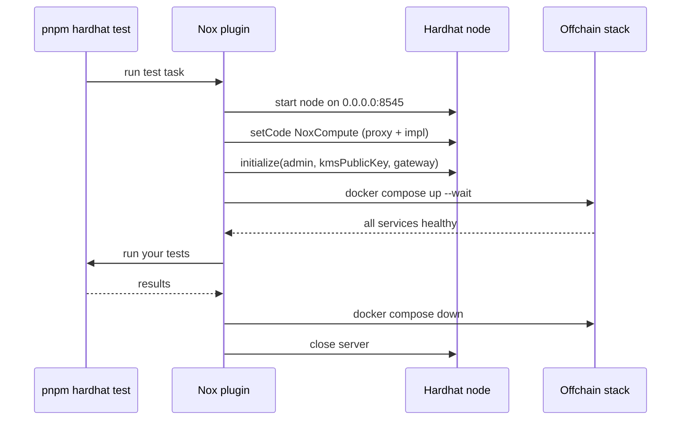

# Hardhat Integration

`@iexec-nox/nox-hardhat-plugin` is a [Hardhat 3](https://hardhat.org/) plugin
that lets you write and run end-to-end tests against the full Nox protocol on
your machine, with zero infrastructure to manage.

When you run `pnpm hardhat test`, the plugin transparently:

1. compiles your project (including the `NoxCompute` contract pulled from
   `@iexec-nox/nox-protocol-contracts`),
2. starts a local Hardhat node,
3. injects `NoxCompute` at its well-known address and initializes it,
4. brings up the Nox offchain stack (KMS, ingestor, runner, handle gateway,
   NATS, S3) with Docker Compose and waits for every service to be healthy,
5. runs your tests against the live stack,
6. tears everything down when the run finishes (or on failure).

The result: your tests can encrypt inputs, deploy confidential contracts, and
decrypt handles exactly as they would against a real Nox deployment.

## Prerequisites

- **Node.js** 22 or 24
- **Docker** with the Compose plugin, running locally (the offchain stack runs
  in containers)
- A **Hardhat 3** project using the
  [`@nomicfoundation/hardhat-toolbox-viem`](https://hardhat.org/plugins/nomicfoundation-hardhat-toolbox-viem)
  toolbox

<!-- prettier-ignore -->
::: warning
The plugin's local stack only supports `chainId` `31337` (the Hardhat default).
On any other network it logs a warning and skips the stack setup, leaving your
tests to run against the configured endpoint.
:::

## Installation

::: code-group

```sh [pnpm]
pnpm add -D @iexec-nox/nox-hardhat-plugin
```

```sh [npm]
npm install --save-dev @iexec-nox/nox-hardhat-plugin
```

```sh [yarn]
yarn add -D @iexec-nox/nox-hardhat-plugin
```

:::

`hardhat` and `@nomicfoundation/hardhat-toolbox-viem` are peer dependencies, so
make sure both are installed in your project.

## Configuration

Register the plugin in your `hardhat.config.ts`. It must be listed alongside the
Viem toolbox, and your default network must use the `op` chain type:

```ts
import hardhatToolboxViemPlugin from '@nomicfoundation/hardhat-toolbox-viem';
import { defineConfig } from 'hardhat/config';
import noxPlugin from '@iexec-nox/nox-hardhat-plugin';

export default defineConfig({
  plugins: [hardhatToolboxViemPlugin, noxPlugin],
  solidity: '0.8.35',
  networks: {
    default: {
      type: 'edr-simulated',
      chainType: 'op',
    },
  },
});
```

That is all the configuration required. The plugin injects the two internal
networks it needs (`noxHost` and `noxLocal`) automatically; you never reference
them directly.

### Plugin options

All options live under the `nox` key in your config:

| Option             | Type      | Default | Description                                                                                                                                                                                      |
| ------------------ | --------- | ------- | ------------------------------------------------------------------------------------------------------------------------------------------------------------------------------------------------ |
| `skipTestOverride` | `boolean` | `false` | When `true`, `hardhat test` runs the original Hardhat action without booting the offchain stack or etching `NoxCompute`. Useful for pure TypeScript tests or to target an already-running stack. |

```ts
import { defineConfig } from 'hardhat/config';

export default defineConfig({
  // ...
  nox: {
    skipTestOverride: true,
  },
});
```

## Running tests

With the plugin configured, run your test suite as usual:

```sh
pnpm hardhat test
```

The first run pulls the offchain service images and may take a while; later runs
reuse the cached images.

<!-- prettier-ignore -->
::: tip
The offchain services run in Docker. Make sure the Docker daemon is started
before running your tests, otherwise the stack setup will fail.
:::

## Writing a test

The plugin exposes a `nox` helper that wraps a Viem network connection together
with a pre-configured [Handle SDK](/references/js-sdk/getting-started) client,
so your tests can encrypt and decrypt without any manual setup.

```ts
import { strict as assert } from 'node:assert';
import { describe, it } from 'node:test';
import { nox } from '@iexec-nox/nox-hardhat-plugin';

describe('MyConfidentialToken', () => {
  it('resolves a publicly decryptable total supply', async () => {
    const { viem } = await nox.connect();

    // Deploy a confidential contract with the standard Viem helpers.
    const token = await viem.deployContract('MyConfidentialToken', [
      'My Confidential Token',
      'MCT',
      'ipfs://example',
      1000n,
    ]);

    // Read an encrypted handle from the contract.
    const handle =
      (await token.read.confidentialTotalSupply()) as `0x${string}`;

    // Ask the Nox stack to decrypt it and assert on the cleartext value.
    const { value } = await nox.publicDecrypt(handle);
    assert.equal(value, 1000n);
  });
});
```

### Encrypting an input

To pass an encrypted value into a contract call, encrypt it first and forward
the resulting `handle` and `handleProof`:

```ts
import { nox } from '@iexec-nox/nox-hardhat-plugin';

const { viem } = await nox.connect();
const [walletClient] = await viem.getWalletClients();

const { handle, handleProof } = await nox.encryptInput(
  42n,
  'uint256',
  walletClient.account.address
);
```

## The `nox` API

| Member                                                   | Description                                                                                                                 |
| -------------------------------------------------------- | --------------------------------------------------------------------------------------------------------------------------- |
| `connect()`                                              | Opens a connection to the local stack and returns a Viem `NetworkConnection` augmented with a ready-to-use `handleClient`.  |
| `encryptInput(value, solidityType, applicationContract)` | Encrypts a plaintext value for a given contract and returns a `{ handle, handleProof }` pair to forward to a contract call. |
| `decrypt(handle)`                                        | Decrypts an ACL-protected handle and returns its cleartext `value` (signs an EIP-712 authorization, no gas).                |
| `publicDecrypt(handle)`                                  | Decrypts a publicly decryptable handle and returns its `value` plus a `decryptionProof`.                                    |

The package also exports a few constants useful in tests and helpers:

| Constant              | Value                                        | Description                                                     |
| --------------------- | -------------------------------------------- | --------------------------------------------------------------- |
| `NOX_COMPUTE_ADDRESS` | `0x75C6AF4430cc474b1bb9b8540b7E46D6f8e1C685` | Well-known address of the `NoxCompute` proxy on the local node. |
| `HANDLE_GATEWAY_URL`  | `http://localhost:3000`                      | Base URL of the local Handle Gateway.                           |
| `RPC_URL`             | `http://127.0.0.1:8545`                      | JSON-RPC endpoint of the local node.                            |

## How it works

The plugin overrides Hardhat's built-in `test` task. Before delegating to the
original action, it provisions a complete local environment and tears it down
afterwards:



`NoxCompute` is etched directly with `hardhat_setCode` rather than deployed
through a transaction: the plugin writes the ERC-1967 proxy and implementation
runtimes, wires the implementation slot, then calls `initialize` to set the
owner, the KMS public key, and the gateway address. This also emits the seed
events the offchain stack relies on.

If a test run fails, the plugin writes the full logs of every offchain service
to `offchain-services.log` in the project directory for diagnostics, while
keeping the test report on stdout readable.

## Next steps

- [Create a confidential ERC-7984 token](/guides/build-confidential-tokens/erc7984-token)
- [Nox JS SDK reference](/references/js-sdk/getting-started)
- [Solidity library reference](/references/solidity-library/getting-started)
