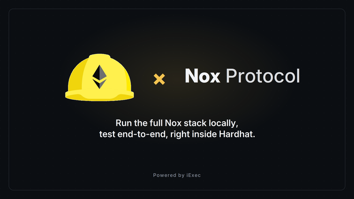

# Hardhat Plugin



## Prerequisites

- **Node.js** 22 or higher
- **Docker** installed and running locally (the offchain stack runs in Docker
  containers)
- A **Hardhat 3** project using either the
  [`@nomicfoundation/hardhat-toolbox-viem`](https://hardhat.org/plugins/nomicfoundation-hardhat-toolbox-viem)
  toolbox (Viem) or the
  [`@nomicfoundation/hardhat-ethers`](https://hardhat.org/plugins/nomicfoundation-hardhat-ethers)
  plugin (Ethers). The plugin auto-detects whichever one your project enables.

## Installation

::: code-group

```sh [pnpm]
pnpm add -D @iexec-nox/nox-hardhat-plugin
```

```sh [npm]
npm install --save-dev @iexec-nox/nox-hardhat-plugin
```

```sh [yarn]
yarn add -D @iexec-nox/nox-hardhat-plugin
```

:::

`hardhat` is a required peer dependency. On top of it you must install **one**
of the two integrations, depending on your stack: the Viem toolbox
(`@nomicfoundation/hardhat-toolbox-viem`) or the Ethers plugin
(`@nomicfoundation/hardhat-ethers`). Install the one your project uses, you
don't need both.

## Configuration

Register the plugin in your `hardhat.config.ts`, alongside your Viem toolbox or
Ethers plugin. Your default network must use the `op` chain type:

::: code-group

```ts [Viem]
import hardhatToolboxViemPlugin from '@nomicfoundation/hardhat-toolbox-viem';
import { defineConfig } from 'hardhat/config';
import noxPlugin from '@iexec-nox/nox-hardhat-plugin';

export default defineConfig({
  plugins: [hardhatToolboxViemPlugin, noxPlugin],
  solidity: '0.8.35',
  networks: {
    default: {
      type: 'edr-simulated',
      chainType: 'op',
    },
  },
});
```

```ts [Ethers]
import hardhatEthersPlugin from '@nomicfoundation/hardhat-ethers';
import { defineConfig } from 'hardhat/config';
import noxPlugin from '@iexec-nox/nox-hardhat-plugin';

export default defineConfig({
  plugins: [hardhatEthersPlugin, noxPlugin],
  solidity: '0.8.35',
  networks: {
    default: {
      type: 'edr-simulated',
      chainType: 'op',
    },
  },
});
```

:::

That is all the configuration required.

### Plugin options

All options live under the `nox` key in your config:

| Option             | Type      | Default | Description                                                                                                                                                                                            |
| ------------------ | --------- | ------- | ------------------------------------------------------------------------------------------------------------------------------------------------------------------------------------------------------ |
| `skipTestOverride` | `boolean` | `false` | When `true`, `hardhat test` runs the original Hardhat action without booting the offchain stack or etching `NoxCompute`. Useful for tests without the Nox stack or to target an already-running stack. |

```ts
import { defineConfig } from 'hardhat/config';

export default defineConfig({
  // ...
  nox: {
    skipTestOverride: true,
  },
});
```

## Running tests

With the plugin configured, run your test suite as usual:

```sh
pnpm hardhat test
```

The first run pulls the offchain service images from DockerHub and may take a
while; subsequent runs reuse existing images.

<!-- prettier-ignore -->
::: tip
The offchain services run in Docker. Make sure the Docker daemon is started
before running your tests, otherwise the stack setup will fail.
:::

## Writing a test

The plugin exposes a `nox` helper that wraps your Viem or Ethers network
connection together with a pre-configured
[Handle SDK](/references/js-sdk/getting-started) client, so your tests can
encrypt and decrypt without any manual setup. `nox.connect()` returns the
connection for whichever integration you enabled (`viem` or `ethers`).

::: code-group

```ts [Viem]
import { strict as assert } from 'node:assert';
import { describe, it } from 'node:test';
import { nox } from '@iexec-nox/nox-hardhat-plugin';

describe('MyConfidentialToken', () => {
  it('resolves a publicly decryptable total supply', async () => {
    const { viem } = await nox.connect();

    // Deploy a confidential contract with the standard Viem helpers.
    const token = await viem.deployContract('MyConfidentialToken', [
      'My Confidential Token',
      'MCT',
      'ipfs://example',
      1000n,
    ]);

    // Read an encrypted handle from the contract.
    const handle =
      (await token.read.confidentialTotalSupply()) as `0x${string}`;

    // Ask the Nox stack to decrypt it and assert on the cleartext value.
    const { value } = await nox.publicDecrypt(handle);
    assert.equal(value, 1000n);
  });
});
```

```ts [Ethers]
import { strict as assert } from 'node:assert';
import { describe, it } from 'node:test';
import { nox } from '@iexec-nox/nox-hardhat-plugin';

describe('MyConfidentialToken', () => {
  it('resolves a publicly decryptable total supply', async () => {
    const { ethers } = await nox.connect();

    // Deploy a confidential contract with the standard Ethers helpers.
    const token = await ethers.deployContract('MyConfidentialToken', [
      'My Confidential Token',
      'MCT',
      'ipfs://example',
      1000n,
    ]);

    // Read an encrypted handle from the contract.
    const handle = (await token.confidentialTotalSupply()) as `0x${string}`;

    // Ask the Nox stack to decrypt it and assert on the cleartext value.
    const { value } = await nox.publicDecrypt(handle);
    assert.equal(value, 1000n);
  });
});
```

:::

## The `nox` API

| Member                                                   | Description                                                                                                                                                                            |
| -------------------------------------------------------- | -------------------------------------------------------------------------------------------------------------------------------------------------------------------------------------- |
| `connect()`                                              | Opens a connection to the local stack. Auto-detects whether your project uses Viem or Ethers and returns the Hardhat `NetworkConnection` augmented with a ready-to-use `handleClient`. |
| `encryptInput(value, solidityType, applicationContract)` | Encrypts a plaintext value for a given contract and returns a `{ handle, handleProof }` pair to forward to a contract call.                                                            |
| `decrypt(handle)`                                        | Decrypts an ACL-protected handle and returns its cleartext `value` (signs an EIP-712 authorization, no gas).                                                                           |
| `publicDecrypt(handle)`                                  | Decrypts a publicly decryptable handle and returns its `value` plus a `decryptionProof`.                                                                                               |

## Next steps

- [Create a confidential ERC-7984 token](/guides/build-confidential-tokens/erc7984-token)
- [Nox JS SDK reference](/references/js-sdk/getting-started)
- [Solidity library reference](/references/solidity-library/getting-started)
