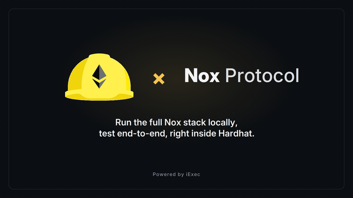

# Hardhat Plugin



## Prerequisites

- **Node.js** 22 or higher
- **Docker** installed and running locally (the offchain stack runs in Docker
  containers)
- A **Hardhat 3** project using either the
  [`@nomicfoundation/hardhat-toolbox-viem`](https://hardhat.org/plugins/nomicfoundation-hardhat-toolbox-viem)
  toolbox (Viem) or the
  [`@nomicfoundation/hardhat-ethers`](https://hardhat.org/plugins/nomicfoundation-hardhat-ethers)
  plugin (Ethers). The plugin auto-detects whichever one your project enables.

## Installation

::: code-group

```sh [pnpm]
pnpm add -D @iexec-nox/nox-hardhat-plugin
pnpm add @iexec-nox/nox-protocol-contracts
```

```sh [npm]
npm install --save-dev @iexec-nox/nox-hardhat-plugin
npm install @iexec-nox/nox-protocol-contracts
```

```sh [yarn]
yarn add -D @iexec-nox/nox-hardhat-plugin
yarn add @iexec-nox/nox-protocol-contracts
```

:::

`hardhat` and `@iexec-nox/nox-protocol-contracts` are required peer
dependencies. On top of them you must install **one** of the two integrations,
depending on your stack: the Viem toolbox
(`@nomicfoundation/hardhat-toolbox-viem`) or the Ethers plugin
(`@nomicfoundation/hardhat-ethers`). Install the one your project uses, you
don't need both.

## Configuration

Register the plugin in your `hardhat.config.ts`, alongside your Viem toolbox or
Ethers plugin:

::: code-group

```ts twoslash [Viem]
import hardhatToolboxViemPlugin from '@nomicfoundation/hardhat-toolbox-viem';
import { defineConfig } from 'hardhat/config';
import noxPlugin from '@iexec-nox/nox-hardhat-plugin';

export default defineConfig({
  plugins: [hardhatToolboxViemPlugin, noxPlugin],
  solidity: '0.8.35',
});
```

```ts twoslash [Ethers]
import hardhatEthersPlugin from '@nomicfoundation/hardhat-ethers';
import { defineConfig } from 'hardhat/config';
import noxPlugin from '@iexec-nox/nox-hardhat-plugin';

export default defineConfig({
  plugins: [hardhatEthersPlugin, noxPlugin],
  solidity: '0.8.35',
});
```

:::

That is all the configuration required.

### Connecting to an edr-simulated network

The plugin boots the local offchain stack automatically when connecting on an
`edr-simulated` network.

```ts twoslash
import { defineConfig } from 'hardhat/config';
import noxPlugin from '@iexec-nox/nox-hardhat-plugin';

export default defineConfig({
  plugins: [
    noxPlugin,
    // ...
  ],
  solidity: '0.8.35',
  // ...
  networks: {
    default: {
      type: 'edr-simulated',
    },
  },
});
```

The first connection to an `edr-simulated` network pulls the offchain service
images from DockerHub and may take a while; subsequent runs reuse existing
images.

<!-- prettier-ignore -->
::: tip
The offchain services run in Docker. Make sure the Docker daemon is started
before running a script that connects to an `edr-simulated` network, otherwise
the stack setup will fail.
:::

### Connecting to an http network

When you call `nox.connect(connection)` on an `http` network — for example a
shared staging deployment — the plugin reads that network's `nox` config to
configure the returned object. Add a `nox` block to that network's entry under
`networks` in your config:

```ts twoslash
import { defineConfig } from 'hardhat/config';
import noxPlugin from '@iexec-nox/nox-hardhat-plugin';

export default defineConfig({
  plugins: [
    noxPlugin,
    // ...
  ],
  solidity: '0.8.35',
  // ...
  networks: {
    staging: {
      type: 'http',
      url: 'https://staging.example.com',
      nox: {
        noxComputeAddress: '0x...',
        handleGatewayUrl: 'https://staging-gateway.example.com',
      },
    },
  },
});
```

The `nox` block is only valid on `http`-type network entries, and
`nox.connect()` rejects if no `nox` config is present for an `http` network.

## Running hardhat scripts

Any Hardhat script can use the `nox` plugin. Call `nox.connect(connection)` with
a `NetworkConnection` obtained from Hardhat to boot (or attach to) the offchain
stack wherever you need it.

```ts twoslash
import { network } from 'hardhat';
import { nox } from '@iexec-nox/nox-hardhat-plugin';

const connection = await network.getOrCreate();
const noxClient = await nox.connect(connection);
```

We use `network.getOrCreate()` rather than `network.create()`: `getOrCreate()`
reuses the same connection and ephemeral Nox stack across repeated calls,
whereas spinning up isolated Nox stacks on isolated connections isn't currently
supported.

## Writing a test

The plugin exposes a `nox` helper. Call `nox.connect(connection)` with a Hardhat
`NetworkConnection` to boot (or attach to) the offchain stack; it resolves to an
object with `encryptInput`, `decrypt`, and `publicDecrypt` methods (backed by
the [Handle SDK](/references/js-sdk/getting-started)), plus `noxComputeAddress`
and `handleGatewayUrl`, so your tests can encrypt and decrypt without any manual
setup.

::: code-group

```ts twoslash [Viem]
import '@nomicfoundation/hardhat-toolbox-viem';
// ---cut---
import { strict as assert } from 'node:assert';
import { before, describe, it } from 'node:test';
import { network } from 'hardhat';
import { nox } from '@iexec-nox/nox-hardhat-plugin';

describe('MyConfidentialToken', () => {
  let connection: Awaited<ReturnType<typeof network.getOrCreate>>;
  let noxClient: Awaited<ReturnType<typeof nox.connect>>;

  before(async () => {
    connection = await network.getOrCreate();
    noxClient = await nox.connect(connection);
  });

  it('resolves a publicly decryptable total supply', async () => {
    // Deploy a confidential contract with the standard Viem helpers.
    const token = await connection.viem.deployContract('MyConfidentialToken', [
      'My Confidential Token',
      'MCT',
      'ipfs://example',
      1000n,
    ]);

    // Read an encrypted handle from the contract.
    const handle =
      (await token.read.confidentialTotalSupply()) as `0x${string}`;

    // Ask the Nox stack to decrypt it and assert on the cleartext value.
    const { value } = await noxClient.publicDecrypt(handle);
    assert.equal(value, 1000n);
  });
});
```

```ts twoslash [Ethers]
import '@nomicfoundation/hardhat-ethers';
// ---cut---
import { strict as assert } from 'node:assert';
import { before, describe, it } from 'node:test';
import { network } from 'hardhat';
import { nox } from '@iexec-nox/nox-hardhat-plugin';

describe('MyConfidentialToken', () => {
  let connection: Awaited<ReturnType<typeof network.getOrCreate>>;
  let noxClient: Awaited<ReturnType<typeof nox.connect>>;

  before(async () => {
    connection = await network.getOrCreate();
    noxClient = await nox.connect(connection);
  });

  it('resolves a publicly decryptable total supply', async () => {
    // Deploy a confidential contract with the standard Ethers helpers.
    const token = await connection.ethers.deployContract(
      'MyConfidentialToken',
      ['My Confidential Token', 'MCT', 'ipfs://example', 1000n]
    );

    // Read an encrypted handle from the contract.
    const handle = (await token.confidentialTotalSupply()) as `0x${string}`;

    // Ask the Nox stack to decrypt it and assert on the cleartext value.
    const { value } = await noxClient.publicDecrypt(handle);
    assert.equal(value, 1000n);
  });
});
```

:::

## The `nox` API

`nox.connect(connection: NetworkConnection): Promise<NoxConnection>` boots (or
attaches to) the offchain stack for the given Hardhat `NetworkConnection` and
resolves to a `NoxConnection` object with the following members:

| Member                                                   | Description                                                                                                                 |
| -------------------------------------------------------- | --------------------------------------------------------------------------------------------------------------------------- |
| `noxComputeAddress`                                      | The address of the `NoxCompute` contract for this connection.                                                               |
| `handleGatewayUrl`                                       | The URL of the Handle Gateway backing this connection.                                                                      |
| `encryptInput(value, solidityType, applicationContract)` | Encrypts a plaintext value for a given contract and returns a `{ handle, handleProof }` pair to forward to a contract call. |
| `decrypt(handle)`                                        | Decrypts an ACL-protected handle and returns its cleartext `value` (signs an EIP-712 authorization, no gas).                |
| `publicDecrypt(handle)`                                  | Decrypts a publicly decryptable handle and returns its `value` plus a `decryptionProof`.                                    |

## Next steps

- [Create a confidential ERC-7984 token](/guides/build-confidential-tokens/erc7984-token)
- [Nox JS SDK reference](/references/js-sdk/getting-started)
- [Solidity library reference](/references/solidity-library/getting-started)
