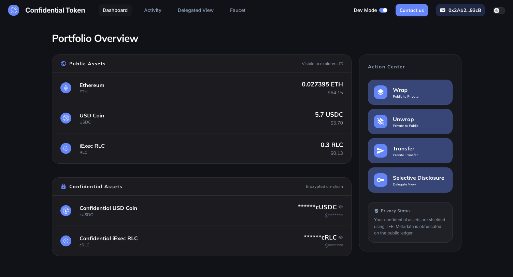

# Live Demo

We built a complete application to show what confidential tokens look like in
practice. It connects to Arbitrum Sepolia testnet and lets you wrap, transfer,
and manage confidential tokens, all from your browser.

<a href="https://cdefi.iex.ec" target="_blank" rel="noopener noreferrer" class="inline-flex items-center gap-2 rounded-lg px-4 py-2.5 text-sm font-medium text-white! bg-[var(--vp-c-brand-1)] no-underline! transition-all duration-200 my-4 hover:bg-[var(--vp-c-brand-2)] hover:-translate-y-px">
  <svg xmlns="http://www.w3.org/2000/svg" width="20" height="20" viewBox="0 0 24 24" fill="none" stroke="currentColor" stroke-width="2" stroke-linecap="round" stroke-linejoin="round"><path d="M18 13v6a2 2 0 0 1-2 2H5a2 2 0 0 1-2-2V8a2 2 0 0 1 2-2h6"/><polyline points="15 3 21 3 21 9"/><line x1="10" y1="14" x2="21" y2="3"/></svg>
  Try the Demo
</a>

## What the demo covers

The application walks through four core capabilities of confidential tokens:

| Feature                  | What it does                                                                             |
| ------------------------ | ---------------------------------------------------------------------------------------- |
| **Wrap**                 | Convert a public ERC-20 token (USDC, RLC) into its confidential equivalent (cUSDC, cRLC) |
| **Transfer**             | Send confidential tokens to another address. The amount stays encrypted on-chain         |
| **Unwrap**               | Convert a confidential token back into a standard ERC-20                                 |
| **Selective Disclosure** | Grant a third party (auditor, regulator) read access to your confidential balance        |

## Prerequisites

To use the demo you need:

- A browser wallet (MetaMask, Rabby, Coinbase Wallet…)
- A small amount of **Arbitrum Sepolia ETH** for gas fees
- Some testnet tokens to wrap. The app includes a faucet to get USDC and RLC

<!-- prettier-ignore -->
::: tip No real funds involved
The demo runs entirely on **Arbitrum Sepolia** (testnet). All tokens are free
and have no monetary value.
:::

## Walkthrough

### 1. Connect and get testnet tokens

Open the app and connect your wallet. If your portfolio is empty, click
**Faucet** to receive free testnet ETH, USDC, or RLC. These are the public
tokens you'll wrap into their confidential versions.

### 2. Wrap tokens

Select a token (for example USDC) and choose an amount. The wrapping process
happens in two steps:

1. **Approve** authorize the confidential token contract to spend your ERC-20
2. **Wrap** lock the ERC-20 and mint the equivalent confidential token (cUSDC)

Once confirmed, your dashboard shows the new confidential balance. Notice that
it appears as an encrypted handle. Click it to decrypt and reveal the amount.
Only you can do this.

### 3. Transfer confidentially

This is where things get interesting. Select a confidential token, enter a
recipient address and an amount. Before the transaction is sent, the JS SDK
sends the amount to the **Handle Gateway** over an attested HTTPS connection;
the Gateway encrypts it inside its **Intel TDX enclave** and returns a handle.
On-chain, the transaction only contains that encrypted handle. No observer can
determine how much was transferred.

The recipient sees a new confidential balance on their end, which they can
decrypt with their own wallet.

### 4. Unwrap tokens

To convert confidential tokens back into standard ERC-20, use the unwrap flow.
The process encrypts the amount, calls the confidential contract, then finalizes
the release of the underlying ERC-20 tokens to your wallet.

### 5. Grant selective disclosure

In a regulated context, you may need to prove your holdings to an auditor
without exposing everything publicly. The selective disclosure feature lets you
grant a specific address **read access** to your confidential balance.

Enter the viewer's address, choose which tokens to share (or all of them), and
confirm. The viewer can then read your balance, but nobody else can.

<!-- prettier-ignore -->
::: info Per-balance access
Access is tied to the current balance handle. After a transaction that changes
your balance (wrap, transfer, unwrap), you need to grant access again for the
new balance.
:::

## How it works

Under the hood, the demo relies on three building blocks:

- **ERC-7984 smart contracts** the on-chain standard for confidential tokens,
  handling wrap, unwrap, and encrypted transfers
- **Nox JS SDK** sends amounts to the Handle Gateway for encryption, and
  decrypts balance handles locally for the wallet owner
- **Handle Gateway** the off-chain service that manages encryption keys and
  processes decryption requests inside a Trusted Execution Environment (TEE)

The application never sees plaintext amounts. The JS SDK forwards the amount to
the Handle Gateway (running inside a TDX TEE) over an attested HTTPS connection;
encryption and storage happen there. Decryption is local — the SDK derives the
plaintext from cryptographic material provided by the KMS, without the KMS ever
seeing the plaintext. The smart contract only manipulates encrypted handles.

## Activity and audit trail

The **Activity** page tracks all your operations (wraps, transfers, unwraps,
access grants) with timestamps and links to the block explorer. The **Delegated
View** page shows a two-way overview: who you've granted access to, and who has
granted access to you.

## Next steps

- [ERC-7984 Token](/guides/build-confidential-tokens/erc7984-token) Learn how to
  create your own confidential token
- [ERC-20 to ERC-7984](/guides/build-confidential-tokens/erc20-to-erc7984-wrapper)
  Wrap an existing ERC-20 into a confidential token
- [Manage Viewers](/guides/manage-handle-access/viewers) Deep dive into access
  control for confidential data
- [JS SDK](/references/js-sdk) Reference for encryption and decryption methods
