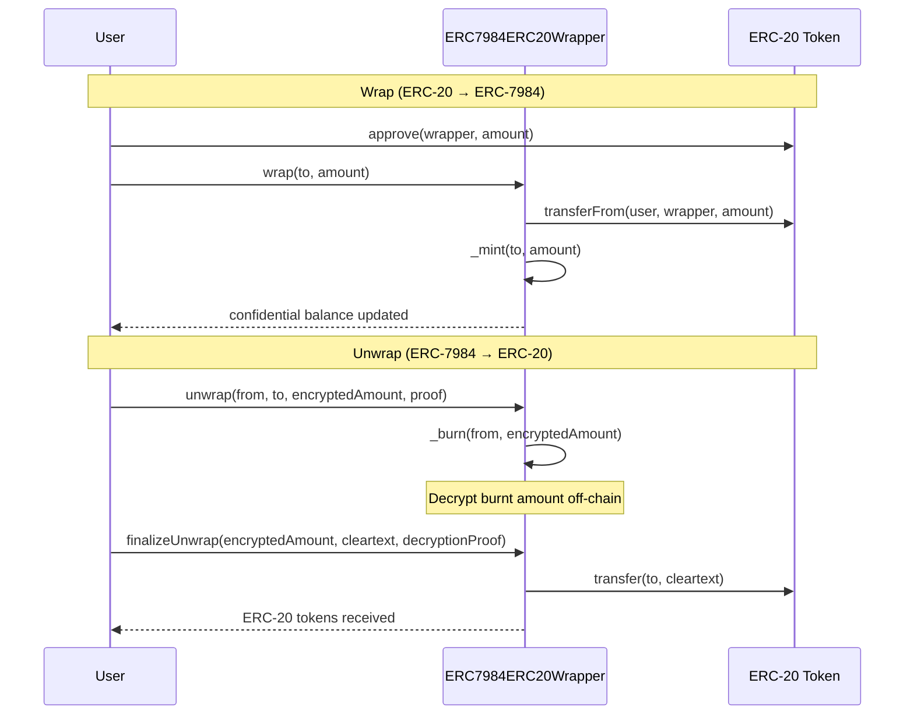

# Wrap ERC-20 into Confidential ERC-7984

An ERC-7984 wrapper lets users convert any existing ERC-20 token into a
confidential ERC-7984 token and back. The underlying ERC-20 tokens are held by
the wrapper contract, while confidential tokens with encrypted balances are
minted 1:1.

## How it works



## Key concepts

### One-step wrap

Wrapping is straightforward: the ERC-20 amount is public, so the wrapper can
transfer and mint in a single transaction. The user approves the wrapper, calls
`wrap()`, and their confidential balance is updated immediately.

### Two-step unwrap

Unwrapping is more complex because the burn amount is encrypted. The wrapper
cannot transfer ERC-20 tokens without knowing the plaintext amount. This
requires two steps:

1. **Request unwrap**: the user calls `unwrap()`, which burns the encrypted
   ERC-7984 tokens
2. **Finalize unwrap**: after the burnt amount is decrypted off-chain (via the
   Nox protocol), the user calls `finalizeUnwrap()` with the decrypted value and
   a decryption proof. The wrapper then transfers the corresponding ERC-20
   tokens

## Deploying a wrapper

To deploy a wrapper, you only need the address of the ERC-20 token you want to
wrap:

```solidity
// SPDX-License-Identifier: MIT
pragma solidity ^0.8.28;

import {ERC7984ERC20Wrapper} from "@iexec-nox/nox-confidential-contracts/contracts/token/utils/ERC7984ERC20Wrapper.sol";
import {IERC20} from "@openzeppelin/contracts/token/ERC20/IERC20.sol";

contract WrappedUSDC is ERC7984ERC20Wrapper {
    constructor(IERC20 usdc)
        ERC7984ERC20Wrapper(usdc)
        ERC7984("Wrapped Confidential USDC", "wcUSDC", "")
    {}
}
```

The wrapper inherits from both `ERC7984` and `ERC7984ERC20Wrapper`. All ERC-7984
features (confidential transfers, operators, callbacks) work on the wrapped
token.

## Swap ERC-20 to ERC-7984

Swapping from a plaintext ERC-20 to a confidential ERC-7984 is done via the
`wrap` function. The ERC-20 tokens are transferred into the wrapper, which mints
the equivalent confidential tokens:

```solidity
function wrap(address to, uint256 amount) public virtual {
    // Transfer ERC-20 tokens from the caller to the wrapper
    SafeERC20.safeTransferFrom(underlying(), msg.sender, address(this), amount);

    // Mint equivalent confidential tokens
    _mint(to, amount);
}
```

From the caller's perspective:

```solidity
// 1. Approve the wrapper
usdc.approve(address(wrappedUSDC), 100e18);

// 2. Wrap into confidential tokens
wrappedUSDC.wrap(msg.sender, 100e18);

// Balance is now encrypted, nobody can see how much you hold
```

The ERC-20 transfer would revert on failure (insufficient balance, missing
approval). The `_mint` is guaranteed to succeed since it only adds to balances.

## Swap ERC-7984 to ERC-20

Swapping from a confidential token back to a plaintext ERC-20 is more complex.
The wrapper needs to know the plaintext amount to transfer ERC-20 tokens, but
the burn amount is encrypted. This requires two steps:

### Step 1: Request unwrap

The user burns their confidential tokens. The burnt amount is recorded as an
encrypted handle:

```solidity
// Encrypt the amount to unwrap
// (off-chain via JS SDK, then call the contract)
wrappedUSDC.unwrap(
    msg.sender,      // burn from
    msg.sender,      // send ERC-20 to
    encryptedAmount,
    inputProof
);
```

### Step 2: Finalize with decryption proof

After the Nox protocol decrypts the burnt amount off-chain, the user calls
`finalizeUnwrap` with the decrypted value and a proof:

```solidity
wrappedUSDC.finalizeUnwrap(
    encryptedAmount,
    cleartextAmount,
    decryptionProof
);
// ERC-20 tokens are transferred to the recipient
```

The wrapper verifies the decryption proof, then transfers `cleartextAmount` of
the underlying ERC-20 to the recipient.

## Next steps

- [ERC-7984 Token](/guides/build-confidential-tokens/erc7984-token): create a
  native confidential token from scratch
- [Demo](/guides/build-confidential-tokens/swap): confidential token swap
  application
- [JS SDK](/references/js-sdk): encrypt inputs and decrypt balances from
  JavaScript
