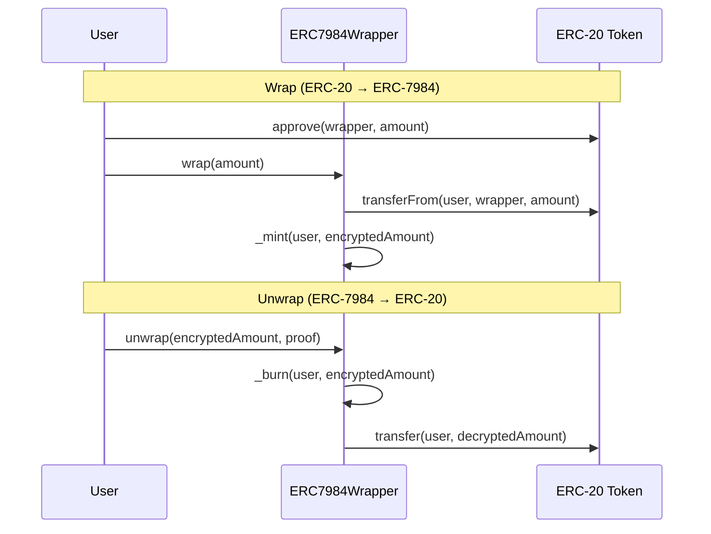

# Wrap ERC-20 into Confidential ERC-7984

<!-- prettier-ignore -->
::: info Coming Soon
This guide is under active development. The ERC-20 to ERC-7984 wrapper contract
will be available in an upcoming release of `@iexec-nox/nox-confidential-contracts`.
:::

## What it will do

An ERC-7984 wrapper lets users convert existing ERC-20 tokens into confidential
ERC-7984 tokens and back:

- **Wrap**: deposit ERC-20 tokens into the wrapper contract, receive an
  equivalent amount of confidential ERC-7984 tokens with encrypted balances
- **Unwrap**: burn confidential ERC-7984 tokens, receive the underlying ERC-20
  tokens back in plaintext

This enables any existing ERC-20 token to gain confidentiality without modifying
the original contract.

## How it works

## Next steps

- [ERC-7984 Token](/guides/build-confidential-tokens/erc7984-token): create a
  native confidential token
- [Demo](/guides/build-confidential-tokens/swap): confidential token swap
  application
