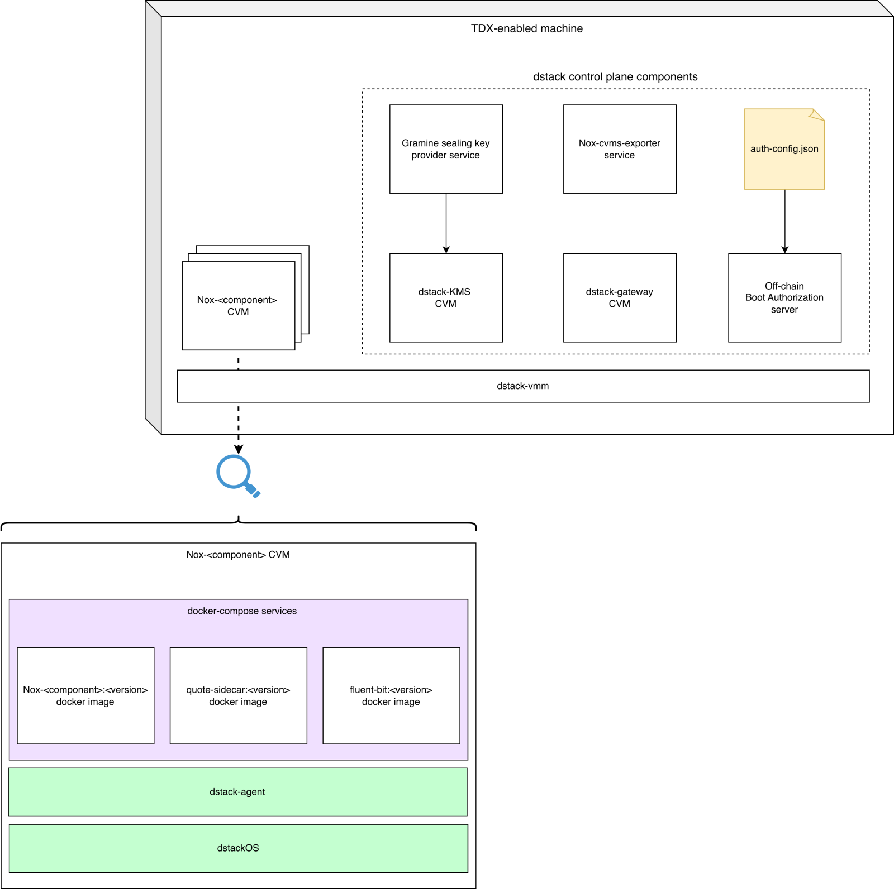

# Chain of Trust

::: info

This page covers the **foundation** of the Nox chain of trust: the TEE layer and
**boot-time attestation**. It explains how each Nox off-chain service is
verified before it is granted access to any secret.

:::

## Why a Chain of Trust?

Nox performs confidential computations over encrypted user data in off-chain
services. For such a system to be trustworthy, you must be convinced of a
non-trivial property:

- The code processing your data is **exactly the code iExec claims to deploy**
- It executes on **genuine confidential-computing hardware**
- Neither the cloud provider nor the protocol operator can **observe or tamper**
  with the data while it is being processed

Establishing this property requires a **chain of trust**: a sequence of
cryptographically verifiable links connecting a hardware root of trust to the
running workload. Each link is independently checkable, so an external party can
conclude, end to end, that a given Nox component is genuinely running the
expected code on genuine confidential hardware.

Several Nox off-chain services handle sensitive material in clear within their
address space: plaintext operands in the [Runner](/protocol/runner), input
plaintext and ciphertext in the [Handle Gateway](/protocol/handle-gateway), and
the protocol private key in the [KMS](/protocol/kms). Protecting their
confidentiality and integrity is the central security concern the chain of trust
addresses, which is why each of them is deployed as an Intel TDX confidential
workload.

## Boot-Time Verification

The foundational link of the chain is **boot-time verification**:

> A Confidential VM (CVM) cannot obtain the secrets it needs to operate unless
> it has booted a **known operating-system image** and a **known application
> stack** on **attested TDX hardware**.

The rest of this page explains how this guarantee is built, layer by layer: the
hardware (Intel TDX), the orchestration (dstack), the deployment architecture,
and the gating mechanism itself.

::: tip Verify it yourself

The live companion to this page is the
[Nox Attestation portal](https://trust.noxprotocol.io/): it lists every Nox
component instance in the fleet (Runner, KMS, Handle Gateway, Ingestor), the TDX
node it runs on, and its live TDX quote. You can also re-verify each attestation
on demand.

:::

## The Hardware Root of Trust: Intel TDX

Intel Trust Domain Extensions (TDX) is a capability of recent Intel Xeon
processors that lets a virtual machine run as a **Trust Domain (TD)**, isolated
from the host operating system, the hypervisor, and the cloud operator. Two
properties make TDX a suitable root of trust for Nox:

**Confidentiality and integrity of runtime state.** The CPU transparently
encrypts the memory of each TD, so neither the host nor a privileged operator
can read or undetectably modify the guest's memory. Each Nox service runs inside
a hardware-isolated CVM whose runtime state is opaque to the hosting provider.

**Measured boot and remote attestation.** As a TD launches, the BIOS and the TDX
module measure its initial state into a set of registers (the static measurement
`MRTD` and the runtime-extendable registers `RTMR[0..3]`), recorded in a signed
_TD-Report_. From this report, the platform produces a **quote**, signed through
Intel's Data Center Attestation Primitives (DCAP) and chaining up to the Intel
SGX Root CA. A remote verifier validates this quote to obtain a hardware-backed
statement of which code the TD runs, and evaluates the platform's Trusted
Computing Base (TCB) status against Intel collateral, accepting only an
up-to-date TCB.

### Hardware Baseline

Nox runs only on bare-metal servers satisfying Intel's TDX enabling guide:

| Requirement       | Baseline                                                                    |
| ----------------- | --------------------------------------------------------------------------- |
| CPU               | 5th-generation Intel Xeon Scalable, or Intel Xeon 6                         |
| Memory            | Fully populated IMC channels (≥ 8 DIMMs per socket)                         |
| BIOS              | TDX, SGX and TME-MT enabled                                                 |
| Kernel            | Canonical TDX-patched kernel                                                |
| Quote generation  | Intel Quote Generation Service (QGS) on the quote-generation vsock port     |
| Certificate cache | Local Intel PCCS caching the PCK certificate chain to embed it in the quote |

## The Orchestration Layer: dstack

[dstack](https://github.com/Dstack-TEE/dstack) is the open-source orchestration
layer, developed by Phala Network, that operates CVMs on top of TDX. It removes
the need to manage Trust Domains by hand and provides the **gating mechanism**
on which boot-time verification rests. Its main components are:

- A **Virtual Machine Monitor (VMM)** and supervisor that boot and supervise
  CVMs from a measured, reproducible dstack OS image
- A **dstack-KMS CVM** that derives application keys inside the enclave and
  decides which workloads may boot by checking their measurements against a
  whitelist
- A **dstack-gateway CVM** that terminates public TLS (with automatic ACME
  certificates) and reverse-proxies traffic to each registered CVM over an
  encrypted WireGuard overlay, load-balancing natively between CVMs that share
  the same application identifier (`app_id`)

dstack also offers an optional on-chain authorization contract (`DstackKms`)
able to whitelist OS-image and per-application compose hashes. Nox currently
keeps this whitelist off-chain; anchoring the set of authorized measurements
on-chain is planned as a later link of the chain of trust.

## Deployment Architecture

### On the TDX Host

| Component                    | Role                                                                                                                                                                                                                                                                                                   |
| ---------------------------- | ------------------------------------------------------------------------------------------------------------------------------------------------------------------------------------------------------------------------------------------------------------------------------------------------------ |
| `dstack-vmm`                 | Boots and supervises every CVM and exposes the deployment interface                                                                                                                                                                                                                                    |
| `dstack-KMS CVM`             | Authorizes or prohibits CVM boots according to the Boot Authorization server decision                                                                                                                                                                                                                  |
| `dstack-gateway CVM`         | Terminates public TLS (ACME certificates) and reverse-proxies external traffic to each registered CVM over a WireGuard overlay                                                                                                                                                                         |
| Boot Authorization server    | Checks whether a CVM is authorized to boot according to its configuration file `auth-config.json`                                                                                                                                                                                                      |
| `auth-config.json`           | Maps each authorized CVM identifier (`app_id`) to its expected compose file hash (`compose_hash`), and lists the authorized guest OS by hash                                                                                                                                                           |
| Gramine Sealing Key Provider | SGX service that provides a local sealing key to the dstack-KMS during its first boot                                                                                                                                                                                                                  |
| Nox CVMs exporter            | Host-side service that exposes, for every CVM on the host, the URL of its quote-service endpoint, so a TDX quote can be generated in real time for any CVM                                                                                                                                             |
| Nox CVMs                     | Business confidential VMs running the Nox off-chain services: [nox-handle-gateway](https://github.com/iExec-Nox/nox-handle-gateway), [nox-runner](https://github.com/iExec-Nox/nox-runner), [nox-kms](https://github.com/iExec-Nox/nox-kms), [nox-ingestor](https://github.com/iExec-Nox/nox-ingestor) |

### Inside a Nox CVM

| Component       | Role                                                                                                                                                                                      |
| --------------- | ----------------------------------------------------------------------------------------------------------------------------------------------------------------------------------------- |
| Nox service     | The Nox business service proper, a Rust binary (e.g. `nox-kms`) running part of the protocol logic                                                                                        |
| `quote-sidecar` | Sidecar mounting the dstack guest socket to expose the CVM's live TDX quote, so an external verifier can fetch and attest it in real time                                                 |
| `fluent-bit`    | Log-forwarding sidecar shipping container logs to a central observability stack                                                                                                           |
| `dstack-agent`  | dstack guest agent; mediates interaction with the dstack control plane, requests keys from the dstack-KMS over the TDX-attested channel and serves the CVM's attestation and app metadata |
| `dstackOS`      | The reproducible dstack guest operating system the CVM boots; its measurement (`os_image_hash`) is taken at boot and checked against the whitelist before any key is released             |

## How a CVM Is Gated at Boot

Every CVM (gateway, KMS, or Nox business service) follows the same attested,
authorized key-provisioning path before it can start serving:

1. **Boot and measurement.** The VMM starts the CVM under TDX. The CVM boots the
   dstack OS image and measures its application info (the `compose_hash`, the
   derived `app_id` and the `instance_id`), extending these values into
   `RTMR[3]`.

2. **Mutual attestation.** The CVM builds an RA-TLS certificate embedding its
   live TDX quote and requests its application keys from the dstack-KMS over
   mutually-authenticated TLS. Each side verifies the other's attestation.

3. **Authorization.** The dstack-KMS extracts the boot info from the attestation
   and calls the Boot Authorization server, which authorizes the boot **only if
   all five checks pass**:
   - the platform TCB status is up to date
   - the OS-image hash matches the whitelist
   - the `app_id` matches `auth-config.json`
   - the `compose_hash` matches `auth-config.json`
   - the device id matches `auth-config.json`

   On refusal, the CVM reboots or shuts down. It never receives any key.

4. **Key release and encrypted disk.** On success, the dstack-KMS derives the
   per-app keys from its root keys and returns them. The CVM mounts its
   encrypted disk with the `disk_crypt_key` and decrypts its sealed environment
   variables.

5. **Service start.** Only then does docker-compose start the application
   containers. Nox business CVMs additionally register with the dstack-gateway
   to join the encrypted WireGuard overlay through which they are reached.

The dstack-KMS itself is bootstrapped differently: on its very first boot it
obtains a hardware-bound sealing key from a local SGX key provider after proving
its measured identity, and generates the protocol root keys. Any subsequent KMS
instance must pass the same Boot Authorization checks before receiving the root
keys from an existing KMS.

The net effect: **no known measurement, no keys; no keys, no disk, no secrets,
no service.**

### Detailed Boot Sequences

The full, step-by-step sequence diagrams are public:

- [dstack-KMS boot sequence](https://github.com/iExec-Nox/dstack/blob/master/docs/kms-boot-sequence.md)
- [dstack-gateway boot sequence](https://github.com/iExec-Nox/dstack/blob/master/docs/gateway-boot-sequence.md)
- [Business (app) CVM boot sequence](https://github.com/iExec-Nox/dstack/blob/master/docs/app-boot-sequence.md)

## Sealed Environment Variables

Secret environment variables (API keys, credentials…) are encrypted by the
operator **before** deployment and decrypted **only inside the attested CVM**,
so that neither the VMM nor the dstack-KMS ever sees their plaintext:

1. The operator fetches a per-app **X25519 public encryption key** from the
   dstack-KMS, verified through a signature from a whitelisted signer.
2. The variables are encrypted client-side with an **ephemeral X25519 key
   exchange + AES-256-GCM**, and the resulting blob is handed to the VMM, which
   stores it without ever being able to decrypt it.
3. During key provisioning, the attested CVM receives the corresponding private
   key (`env_crypt_key`) over the attested channel, recomputes the shared
   secret, decrypts the variables, and filters them against the `allowed_envs`
   list from its compose file.

This construction provides confidentiality (only the attested CVM can decrypt),
integrity (AES-GCM detects tampering), forward secrecy (each deployment uses a
fresh ephemeral key), and blindness of both the VMM and the KMS. The key is
derived per `app_id`, so instances of the same app share it while different apps
cannot read one another's variables.

See the full
[environment-variable encryption sequence](https://github.com/iExec-Nox/dstack/blob/master/docs/env-encryption-sequence.md).

## Proof-of-Cloud: Hardware Provenance

Measured boot and remote attestation establish **what** code a CVM runs and
**that** it runs on genuine Intel TDX silicon. They do not, by themselves,
establish **where** that silicon is: the physical and operational provenance of
the host.

**Proof-of-Cloud** is the complementary seal that addresses this gap: it binds
an attested TDX platform to a known, reputable hosting environment. It is
coordinated by the [Proof of Cloud Alliance](https://proofofcloud.org/), a
vendor-neutral group of which iExec is a member, that maintains a signed,
append-only registry binding TEE hardware identities (the Intel DCAP `PPID`
extracted from the attestation quote) to independently verified physical
facilities. Member organizations cross-verify each location during a dedicated
whitelisting ceremony, so a verifier can establish not only that a workload runs
on genuine TDX silicon, but also that this silicon sits in a facility multiple
independent parties have vouched for.

In the current Nox fleet, this property is tracked per node. The testnet fleet
runs two TDX nodes: `node1`, hosted at OVH, and `node2`, hosted at phoenixNAP.
Of these two, `node1` carries a Proof-of-Cloud seal and `node2` does not. The
distinction is meaningful for an external verifier: where present,
Proof-of-Cloud raises the cost of relocation or substitution attacks by tying
the attested platform to a provider's verified infrastructure, rather than
relying on the quote alone to vouch for an otherwise anonymous host. Within the
chain of trust, it should be read as a **provenance complement** to TDX
attestation, not a replacement: TDX attests the integrity and identity of the
execution environment, while Proof-of-Cloud attests the integrity of its hosting
context.

## Beyond Boot-Time Attestation

Boot-time verification is the foundation of the chain of trust, but not its full
extent. The higher links build on it:

- **Runtime attestation**: surfacing live attestation evidence to end users
  (already explorable today on the
  [Attestation portal](https://trust.noxprotocol.io/))
- **Source-code binding**: proving that the running images are built from the
  public source code
- **On-chain governance**: anchoring the set of authorized measurements on-chain

## Further Reading

- [Nox Attestation portal](https://trust.noxprotocol.io/): live, re-verifiable
  attestation evidence for every component instance in the Nox fleet
- [Chain of Trust for Nox](https://x.com/iex_ec/status/2077021734453019059): the
  original iExec publication of this article
- [How iExec Uses dstack For OnChain Finance](https://phala.com/posts/iexec-dstack-nox-chain-of-trust):
  Phala's perspective on the dstack integration and runtime quote generation
