# Handle Gateway

The Handle Gateway is a Rust service running in Intel TDX. It is the single
entry point for creating, storing and accessing encrypted handle data. It
encrypts plaintext values using the KMS public key, manages a PostgreSQL
database of handles, and coordinates decryption delegation with the
[KMS](/protocol/kms).

## Role in the Protocol

The Gateway sits between users/Runners and the encrypted data store. It has
three main responsibilities:

1. **Encrypt and store** plaintext values submitted by users (via SDK) as
   handles
2. **Delegate decryption** by coordinating with the KMS and serving the
   cryptographic material to authorized users and Runners
3. **Store** computation results submitted by Runners
4. **Verify** access control by checking the on-chain ACL contract

## How It Works

### Handle Creation


### Encryption Process


### User Decryption

```mermaid
sequenceDiagram
    participant U as User (SDK)
    participant GW as Handle Gateway
    participant KMS

    U->>U: Generate ephemeral RSA keypair
    U->>GW: GET /v0/secrets/:handle (RSA pubkey, EIP-712 auth)
    GW->>GW: Verify signature + check on-chain ACL
    GW->>GW: Retrieve (ciphertext, K, nonce) from DB
    GW->>KMS: POST /v0/delegate (K, RSA pubkey)
    KMS-->>GW: encryptedSharedSecret
    GW-->>U: ciphertext + encryptedSharedSecret + nonce
    U->>U: RSA decrypt, HKDF, AES-GCM decrypt → plaintext
```



## API

### `POST /v0/secrets`

Encrypts a plaintext value and creates a new handle.

**Request:**

```json
{
  "value": "0x...",
  "solidityType": "uint256",
  "owner": "0x...",
  "applicationContract": "0x..."
}
```

- `value`: hex-encoded plaintext (see
  [plaintext encoding spec](https://iexecproject.atlassian.net/wiki/spaces/IP/pages/4279599105))
- `solidityType`: target Solidity type (`uint8`, `uint256`, `bool`, `address`,
  etc.)

**Response:**

```json
{
  "handle": "0x...",
  "proof": "0x..."
}
```

The proof is an EIP-712 signed `HandleProof` containing the handle, owner,
application contract address, and creation timestamp. The user submits this
proof on-chain when using the handle in a smart contract call.

### `GET /v0/secrets/:handle`

Returns the cryptographic material needed for a user to decrypt a handle
locally.

**Authorization:** EIP-712 signed `DataAccessAuthorization` in the
`Authorization` header:

```
Authorization: EIP712 Base64({
  payload: {
    userAddress,
    encryptionPubKey,  // ephemeral RSA pubkey (SPKI, hex with 0x)
    notBefore,
    expiresAt
  },
  signature
})
```

The Gateway verifies the signature, checks the on-chain ACL, then coordinates
with the KMS to perform decryption delegation.

**Response:**

```json
{
  "handle": "0x...",
  "ciphertext": "0x...",
  "encryptedSharedSecret": "0x...",
  "iv": "0x..."
}
```

- `encryptedSharedSecret`: shared secret encrypted with the user's RSA public
  key
- `iv`: 12-byte AES-GCM initialization vector

The user decrypts the shared secret with their RSA private key, derives the
AES-256 key via HKDF, and decrypts the ciphertext locally.

### `GET /v0/compute/operands`

Returns the cryptographic material needed for a Runner to decrypt all input
handles of a computation. The Gateway handles KMS delegation internally (same
as `GET /v0/secrets/:handle` for users).

**Request body:**

```json
{
  "caller": "0x...",
  "rsaPublicKey": "0x...",
  "operands": ["0x...", "0x..."],
  "results": ["0x..."]
}
```

- `caller`: address of the contract that initiated the computation
- `rsaPublicKey`: Runner's ephemeral RSA public key (SPKI, hex with `0x`)
- `operands`: input handle identifiers
- `results`: output handle identifiers

**Response:**

```json
[
  {
    "handle": "0x...",
    "ciphertext": "0x...",
    "encryptedSharedSecret": "0x...",
    "iv": "0x..."
  }
]
```

The Runner decrypts each operand locally: RSA decrypt the shared secret, derive
AES-256 key via HKDF, AES-GCM decrypt the ciphertext.

Returns an error if any input handle is missing from the database.

### `POST /v0/compute/results`

Runners submit encrypted results after executing a computation.

**Request:**

```json
{
  "chainId": 1,
  "blockNumber": 12345,
  "caller": "0x...",
  "transactionHash": "0x...",
  "handles": [
    {
      "handle": "0x...",
      "ciphertext": "0x...",
      "public_key": "0x...",
      "nonce": "0x..."
    }
  ]
}
```

| Status | Condition                              |
| ------ | -------------------------------------- |
| 200    | All handles stored successfully        |
| 401    | Runner not authorized (to be enforced) |
| 500    | Database storage error                 |

## Database

::: info Current Implementation

The current implementation uses **PostgreSQL**. The target architecture will
migrate to an **S3-compatible object store** with finance-grade certifications,
providing regulatory compliance and auditability guarantees for encrypted data
at rest.

:::

### Schema

| Column       | Constraint | Description                                    |
| ------------ | ---------- | ---------------------------------------------- |
| `handle`     | PK, Unique | 32-byte handle identifier                      |
| `owner`      |            | Ethereum address of the data owner             |
| `ciphertext` |            | Encrypted value                                |
| `K`          | Unique     | Ephemeral public key for decryption delegation |
| `nonce`      |            | 12-byte AES-GCM nonce                          |
| `createdAt`  |            | Creation timestamp                             |

## Exchange Format Conventions

- Data exchanged in **JSON** format
- Object keys use **camelCase**
- Binary data encoded as **hexadecimal strings with `0x` prefix**

## Learn More

- [KMS](/protocol/kms) - Key Management Service
- [Runner](/protocol/runner) - Computation execution
- [Nox Smart Contracts](/protocol/nox-smart-contracts) - On-chain contracts
- [Global Architecture Overview](/protocol/global-architecture-overview)
