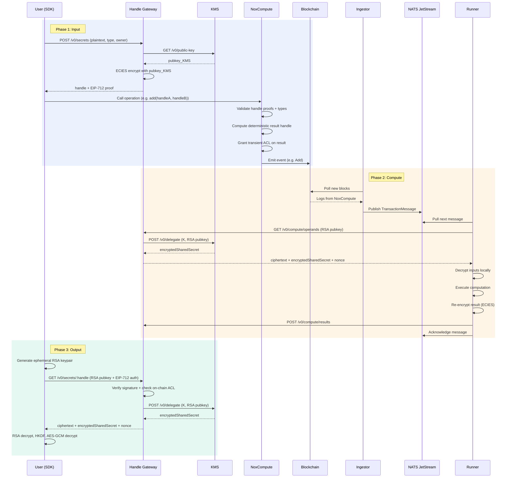
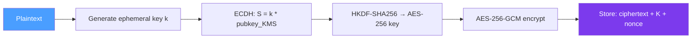

# Global Architecture Overview

Nox is a confidential computation protocol for DeFi. It allows smart contracts
to operate on encrypted data without ever exposing plaintext on-chain. The
protocol coordinates five components: on-chain smart contracts, an event
listener (Ingestor), a message queue (NATS), a computation engine (Runner), an
encrypted data store (Handle Gateway), and a key management service (KMS).


## End-to-End Flow

A confidential computation in Nox follows three phases: **input**, **compute**,
and **output**. The diagram below shows the complete lifecycle of an encrypted
operation, from user input to result retrieval.



### Phase 1: Input

The user encrypts sensitive data off-chain and submits it to a smart contract
using opaque **handles** (32-byte identifiers that reference the encrypted data
stored in the Gateway).

1. The user sends a plaintext value to the **Handle Gateway** via the SDK
2. The Gateway encrypts it with [ECIES](/protocol/kms#ecies-encryption-scheme)
   using the KMS public key and stores the ciphertext in PostgreSQL
3. The Gateway returns a **handle** and an **EIP-712 signed proof** attesting
   the handle's validity
4. The user calls a function on a smart contract that uses the **NoxCompute**
   library (e.g. `Nox.add(handleA, handleB)`)
5. NoxCompute validates handle proofs and type compatibility, computes a
   deterministic result handle, grants transient ACL access on it, and **emits
   an event** containing the input and output handles

At this point, the on-chain transaction is complete. The encrypted result does
not exist yet: it will be computed off-chain.

### Phase 2: Compute

The off-chain pipeline picks up the event and executes the computation inside a
secure environment.

1. The **Ingestor** polls new blocks from the blockchain RPC, filters NoxCompute
   logs, groups events by transaction, and publishes a `TransactionMessage` to
   **NATS JetStream**
2. The **Runner** pulls the next message from the queue
3. The Runner requests the encrypted operands from the **Handle Gateway**,
   providing an ephemeral RSA public key
4. The Gateway retrieves the ciphertext from its database and coordinates with
   the **KMS** to perform [decryption delegation](/protocol/kms): the KMS
   computes the ECDH shared secret and encrypts it with the Runner's RSA key
5. The Runner decrypts the inputs locally (RSA decrypt the shared secret, HKDF
   key derivation, AES-GCM decrypt), executes the computation, and re-encrypts
   the result with ECIES using the KMS public key
6. The Runner submits the encrypted result to the Gateway and acknowledges the
   NATS message

### Phase 3: Output

When the user wants to read a result, the protocol performs decryption
delegation so that only the authorized user can recover the plaintext.

1. The user generates an ephemeral RSA keypair and sends a decryption request to
   the Gateway, authenticated with an EIP-712 signature
2. The Gateway verifies the signature and checks the **on-chain ACL** to confirm
   the user has viewer permission on the handle
3. The Gateway requests decryption delegation from the KMS: the KMS computes the
   shared secret and encrypts it with the user's RSA public key
4. The user receives the ciphertext, encrypted shared secret, and nonce, then
   decrypts locally: RSA decrypt the shared secret, derive the AES key via HKDF,
   and AES-GCM decrypt the ciphertext

The KMS never sees plaintext data. Only the final recipient (user or Runner)
performs the actual decryption.

## Handles

A **handle** is a 32-byte identifier that references an encrypted value stored
in the Gateway. It does not contain the ciphertext itself.

```
[0---------------------25]   [26------29]   [30]   [31]
    prehandle (26 bytes)       Chain ID     Type   Version
```

| Segment   | Size     | Description                                                                              |
| --------- | -------- | ---------------------------------------------------------------------------------------- |
| Prehandle | 26 bytes | Truncated keccak256 hash (deterministic for computation results, random for user inputs) |
| Chain ID  | 4 bytes  | Binds the handle to a specific blockchain                                                |
| Type      | 1 byte   | Solidity type of the encrypted value (uint8, bool, address, etc.)                        |
| Version   | 1 byte   | Handle format version (currently `0x00`)                                                 |

For computation results, the prehandle is derived from the operator, input
handles, contract address, caller, timestamp, and output index. This makes
handles **deterministic**: the same operation on the same inputs in the same
transaction always produces the same handle.

For user inputs created via the Gateway, the prehandle is a random value. The
handle is validated on-chain via an EIP-712 signed proof from the Gateway.

For the full handle specification, see
[Nox Smart Contracts](/protocol/nox-smart-contracts#handle-structure).

## Access Control

The **ACL** contract manages who can use a handle as a computation input and who
can decrypt the underlying data.

| Permission    | Granted by                    | Capability                                                 |
| ------------- | ----------------------------- | ---------------------------------------------------------- |
| **Admin**     | `ACL.allow()`                 | Use handle as computation input, manage permissions        |
| **Transient** | NoxCompute (automatic)        | One-time use within the current transaction, cleared after |
| **Viewer**    | `ACL.addViewer()`             | Decrypt the associated data via the Gateway                |
| **Public**    | `ACL.allowPublicDecryption()` | Anyone can decrypt                                         |

When NoxCompute creates a result handle, it automatically grants **transient**
access to the calling contract. The contract must persist this permission with
`ACL.allow()` if the handle needs to be used in subsequent transactions.

The Gateway checks ACL permissions on-chain (via `isViewer`) before serving
decryption material to a user.

## Encryption

All encrypted data in Nox is protected with **ECIES** (Elliptic Curve Integrated
Encryption Scheme) on secp256k1, using the KMS public key as the encryption
target.



The KMS holds the corresponding private key but **never decrypts data
directly**. Instead, it performs **decryption delegation**: it computes the ECDH
shared secret and encrypts it with the requester's RSA public key. The requester
then derives the AES key locally and decrypts the ciphertext.

For the full cryptographic protocol, see [KMS](/protocol/kms).

## Learn More

- [KMS](/protocol/kms): cryptographic protocol and decryption delegation
- [Runner](/protocol/runner): computation engine and supported operations
- [Handle Gateway](/protocol/gateway): encryption, storage, and API reference
- [Ingestor](/protocol/ingestor): blockchain monitoring and event pipeline
- [Nox Smart Contracts](/protocol/nox-smart-contracts): on-chain contracts,
  handle structure, and ACL
- [Computation Primitives](/protocol/computation-primitives): full reference of
  all operations
- [Protocol Vision](/protocol/protocol-vision): long-term architecture and
  roadmap
