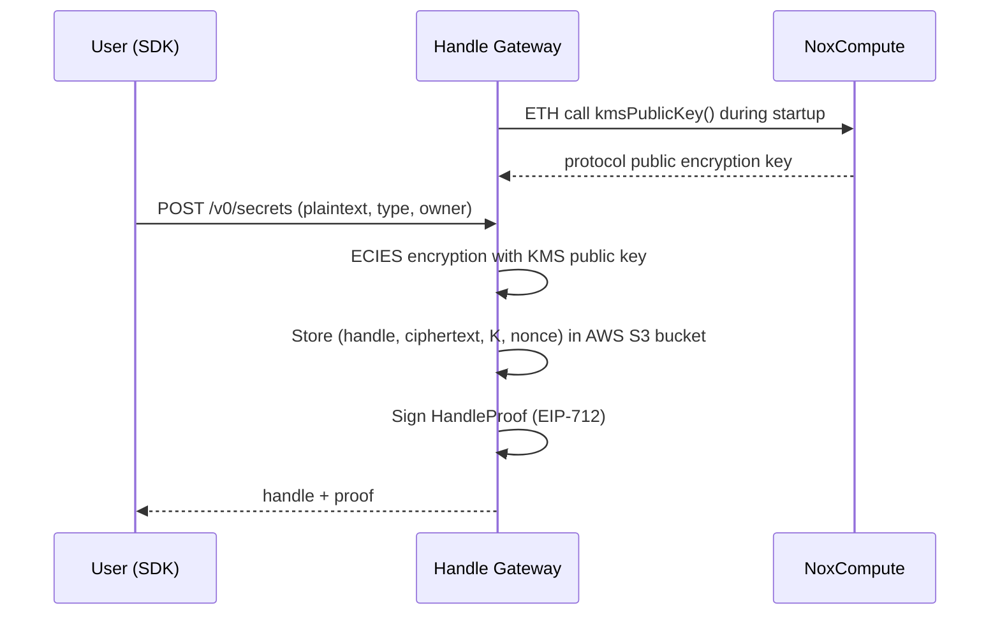
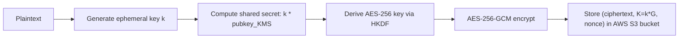
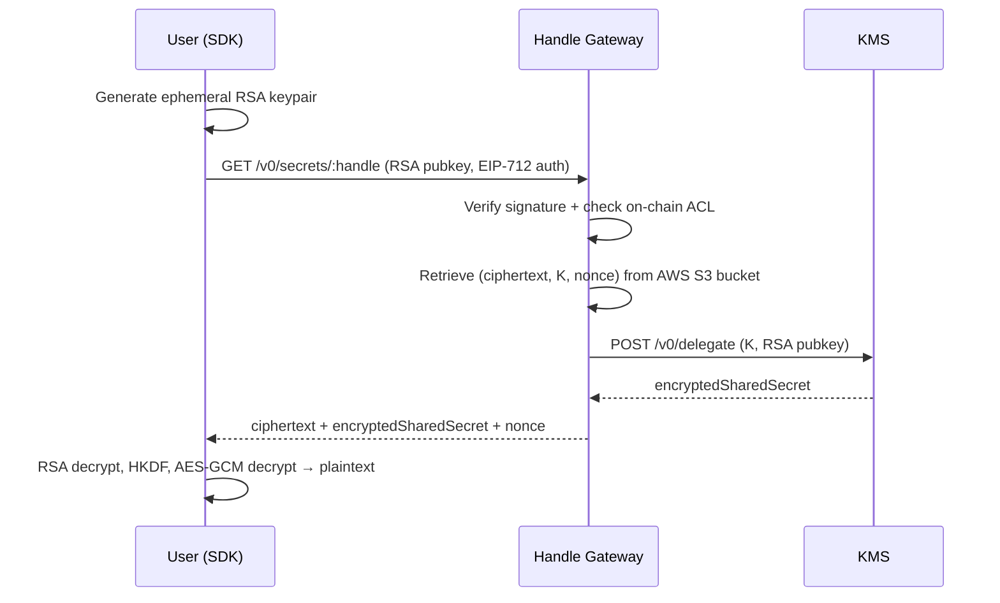

# Handle Gateway

The Handle Gateway is a Rust service running in Intel TDX. It is the single
entry point for creating, storing and accessing encrypted handle data. It
encrypts plaintext values using the KMS public key, interacts with an **AWS S3
bucket** of handles, and coordinates decryption delegation with the
[KMS](/protocol/kms).

## Role in the Protocol

The Handle Gateway sits between users/Runners and the encrypted data store. It
has four main responsibilities:

1. **Encrypt** plaintext values submitted by users (via SDK), then **store**
   them as handles.
2. **Verify** access control by checking the on-chain ACLs.
3. **Delegate decryption** by coordinating with the KMS and serving the
   cryptographic material to authorized users and Runners.
4. **Store** encrypted computation results submitted by Runners as handles.

## How It Works

### Handle Creation

### Encryption Process

### User Decryption

## Storage

::: info Current Implementation

The current implementation uses an **AWS S3 bucket** without finance-grade
certifications. The production environment will target a **S3 bucket service**
with finance-grade certifications to provide regulatory compliance and
auditability guarantees for encrypted data at rest.

:::

## Exchange Format Conventions

- Data exchanged in **JSON** format
- Object keys use **camelCase**
- Binary data encoded as **hexadecimal strings with `0x` prefix**

## Learn More

- [KMS](/protocol/kms) - Key Management Service
- [Runner](/protocol/runner) - Computation execution
- [Nox Smart Contracts](/protocol/nox-smart-contracts) - On-chain contracts
- [Global Architecture Overview](/protocol/global-architecture-overview)
