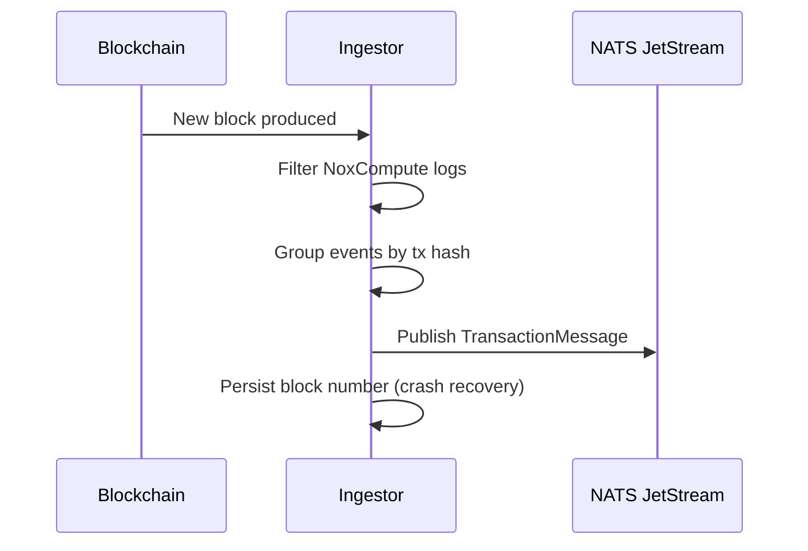

# Ingestor

The Ingestor is a Rust service running in Intel TDX that continuously monitors
the blockchain for events emitted by the `NoxCompute` contract and publishes
them to a NATS JetStream queue for processing by the [Runner](/protocol/runner).

## Role in the Protocol

The Ingestor bridges on-chain and off-chain worlds: it detects computation
requests emitted as Solidity events and forwards them as structured messages to
the message queue. It is the starting point of every off-chain computation.

## How It Works



1. **Poll blocks**: the Ingestor reads new blocks from the blockchain RPC in
   batches, with a configurable polling interval.

2. **Parse events**: contract logs are parsed using Alloy's `sol!` macro for
   compile-time type safety. Each event is mapped to a strongly-typed Rust
   struct.

3. **Group by transaction**: events from the same transaction are grouped into a
   single `TransactionMessage` and ordered by `log_index`, preserving on-chain
   execution order.

4. **Publish to NATS**: the message is published to NATS JetStream with a
   checksum-based message ID for deduplication (prevents duplicate processing on
   restarts).

5. **Persist state**: the last processed block number is saved to disk, allowing
   the Ingestor to resume from where it left off after a restart.

## Monitored Events

The Ingestor listens for **all events** emitted by the `NoxCompute` contract.
Each event corresponds to a computation primitive (arithmetic, comparisons,
token operations, etc.). See
[Computation Primitives](/protocol/computation-primitives) for the full list.

## Message Format

```rust
TransactionMessage {
    chain_id: u32,
    caller: Address,
    block_number: u64,
    transaction_hash: String,
    events: Vec<TransactionEvent>,  // ordered by log_index
}
```

Each `TransactionEvent` contains the operation type and the associated handles
(input and output).

## Key Design Choices

- **Optimistic processing**: blocks are processed as soon as they appear,
  without waiting for confirmations. This enables low-latency event detection.
- **Deduplication**: NATS message IDs based on content checksums prevent
  duplicate processing when the Ingestor restarts and re-reads recent blocks.
- **Stateless scaling**: multiple Ingestor instances can run in parallel for
  redundancy. NATS deduplication ensures each event is processed only once.

## Learn More

- [Runner](/protocol/runner) - Processes the computation requests
- [Gateway](/protocol/gateway) - Stores encrypted handle data
- [Nox Smart Contracts](/protocol/nox-smart-contracts) - Emits the monitored
  events
- [Global Architecture Overview](/protocol/global-architecture-overview)
