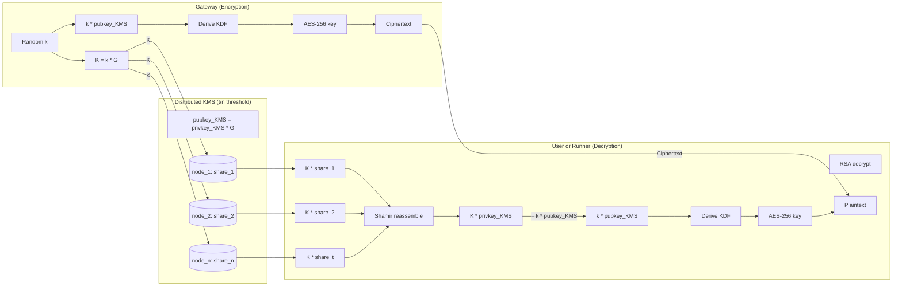

# Key Management Service (KMS)

The KMS generates and manages the cryptographic keys used for encryption and decryption delegation. It never decrypts data — it only provides the shared secret needed for clients to decrypt locally.

## Key Concepts

| Term | Description |
| ---- | ----------- |
| **G** | Generator point on the elliptic curve (public constant) |
| **privkey_KMS** | KMS private key (split into shares, never stored whole) |
| **pubkey_KMS** | KMS public key: `pubkey_KMS = privkey_KMS * G` |
| **t/n threshold** | At least `t` out of `n` nodes must collaborate to perform operations |

## How It Works

1. **Gateway encrypts** — The Gateway generates a random ephemeral key `k`, computes the shared secret `k * pubkey_KMS` derives an AES-256 key and encrypts the data with the AES-256 key. The ephemeral public key `K = k * G` is stored with the ciphertext.

2. **Gateway requests delegation** — When a User or Runner requests decryption, the Gateway verifies the on-chain ACL. If authorized, the Gateway forwards the request to the KMS. Each KMS node computes `K * share_i` using its secret share and encrypts the result with the client's RSA public key.

3. **Client decrypts** — The client collects at least `t` partial results from the KMS nodes, decrypts each with their RSA private key, and reassembles them to recover `K * privkey_KMS`. This equals `k * pubkey_KMS` (the original shared secret) because `K * privkey_KMS = (k * G) * privkey_KMS = k * pubkey_KMS`. The client then derives the AES-256 key using HKDF and decrypts the ciphertext locally.

## ECIES Encryption

The KMS uses **ECIES** (Elliptic Curve Integrated Encryption Scheme):

- **Public key**: `pubkey_A = privkey_A * G` (G is the curve generator)
- **Shared secret**: `k * pubkey_A` where `k` is a random ephemeral key
- **Ephemeral public key**: `K = k * G` (stored with ciphertext for delegation)

### AES-256-GCM Key Derivation

The AES key is derived from the shared secret using **HKDF (SHA-256)**:

- **Input**: x-coordinate of the shared secret point (32 bytes)
- **Info**: `"ECIES:AES_GCM:v1"` (`45434945533a4145535f47434d3a7631` in hex)
- **Salt**: 32 bytes of zeros

## Decryption Delegation

When a user requests decryption:

1. User generates an **RSA-OAEP 2048** keypair (public exponent 65537)
2. User exports the public key in **SPKI format** as a hex string (no `0x` prefix)
3. KMS computes the shared secret `K * privkey_A`
4. KMS encrypts the shared secret with the user's RSA public key
5. User decrypts the shared secret locally and derives the AES key

::: warning Security
The KMS never sees the plaintext. Only the RSA-encrypted shared secret travels over the network.
:::

## Threshold Cryptography

### What is a Share?

A **share** is a piece of the private key. Individually, a share reveals nothing about the private key. But when `t` shares are combined using Lagrange interpolation, the original secret can be reconstructed.

In practice, shares are never combined directly. Instead, each node computes a **partial result** (`K * share_i`), and these partial results are reassembled to get `K * privkey_KMS` — the private key itself is never reconstructed.

| Concept | Description |
| ------- | ----------- |
| **n** | Total number of KMS nodes |
| **t** | Minimum shares required (threshold) |
| **share_i** | Node i's piece of the private key |
| **DKG** | Distributed Key Generation — setup protocol |

::: info Current Status
MVP uses a single KMS node running in a TEE. The distributed threshold KMS (t/n) is the long-term architecture.
:::

## Learn More

- [Global Architecture Overview](/protocol/global-architecture-overview)
- [Gateway](/protocol/gateway)
- [Runner](/protocol/runner)
