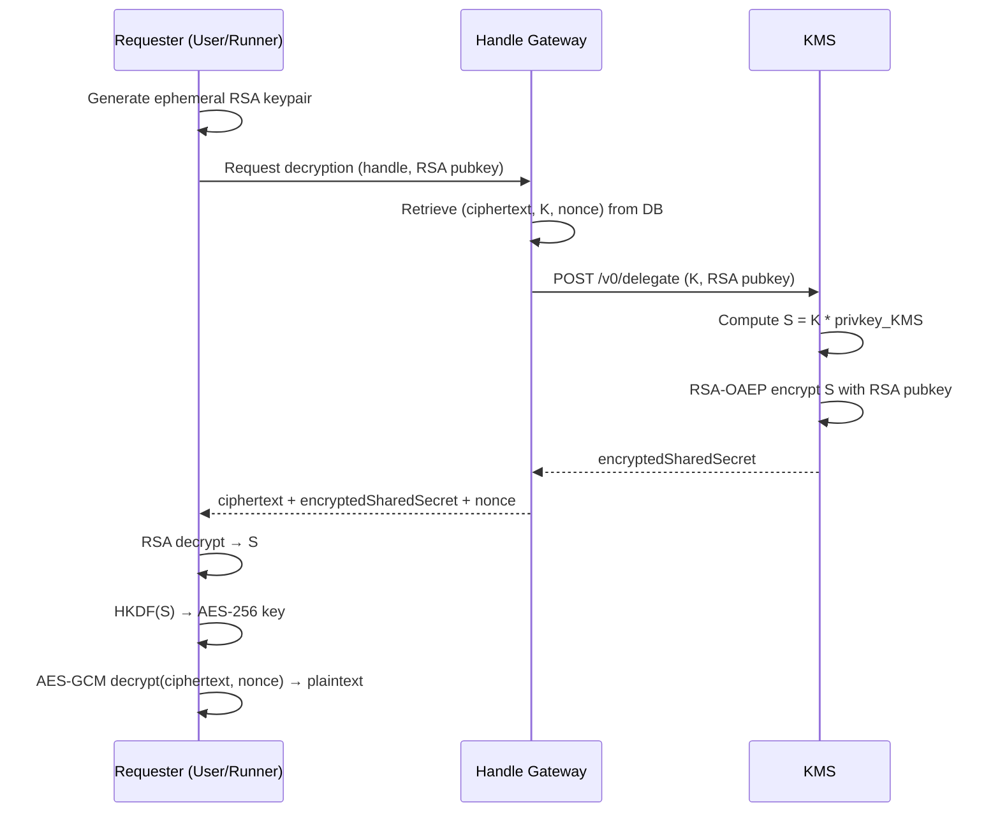

# Key Management Service (KMS)

The KMS is a Rust service running in Intel TDX that manages the protocol's
cryptographic keys. It **never decrypts data itself**. It only delegates
decryption by providing the cryptographic material (shared secret) needed for
authorized parties to decrypt locally.

## Role in the Protocol

The KMS holds the **protocol private key** (secp256k1). All data stored in the
Handle Gateway is encrypted under the corresponding public key. When a user or
Runner needs to decrypt, the KMS performs a **decryption delegation**: it
computes a shared secret and encrypts it with the requester's RSA public key, so
only the requester can recover it.

## How It Works

### Decryption Delegation Flow



::: warning Security

The KMS never sees plaintext data. Only the RSA-encrypted shared secret travels
over the network. The requester performs the final decryption locally.

:::

### ECIES Encryption Scheme

The protocol uses **ECIES** (Elliptic Curve Integrated Encryption Scheme) on
secp256k1:

1. Generate a random ephemeral scalar `k`
2. Compute the ephemeral public key `K = k * G`
3. Compute the shared secret `S = k * pubkey_KMS`
4. Derive an AES-256 key from `S` using HKDF-SHA256
5. Encrypt plaintext with AES-256-GCM (random 12-byte nonce)
6. Store: `(ciphertext, K, nonce)` alongside the handle

### Key Derivation (HKDF)

| Parameter | Value                    |
| --------- | ------------------------ |
| Hash      | SHA-256                  |
| IKM       | Shared secret (32 bytes) |
| Salt      | 32 bytes of zeros        |
| Info      | `"ECIES:AES_GCM:v1"`     |
| Output    | 32 bytes (AES-256 key)   |

## Threshold Architecture

The long-term design uses **threshold cryptography** based on
[Shamir's Secret Sharing](https://en.wikipedia.org/wiki/Shamir%27s_secret_sharing)
(SSS):

- The private key is split into **n shares** using a random polynomial of degree
  `t-1`, where `P(0) = privkey_KMS`
- Each KMS node `i` holds `share_i = P(i)`, one point on the polynomial
- At least **t shares** are needed to reconstruct `P(0)` via **Lagrange
  interpolation**. Fewer than `t` shares reveal nothing
- In practice, the private key is **never reconstructed**. Each node computes a
  partial result `K * share_i`, and the client recombines them using Lagrange
  coefficients: `Σ λ_i * (K * share_i) = K * privkey_KMS`

This eliminates single points of failure: compromising fewer than `t` nodes
reveals nothing about the private key.

::: info Current Implementation

The MVP runs a **single KMS node** that holds the full private key. The
threshold protocol (t/n with distributed key generation) is the target
architecture for production.

:::

## API

### `GET /v0/public-key`

Returns the KMS public key with an EIP-712 signed proof.

**Response:**

```json
{
  "publicKey": "0x...",
  "proof": "0x..."
}
```

The proof uses the EIP-712 domain `ProtocolPublicKey` (version `"1"`) with a
`PublicKeyProof` struct containing the public key.

### `POST /v0/delegate`

Performs decryption delegation. Given an ephemeral Elliptic Curve public key `K`
(from encryption) and a target RSA public key, the KMS:

1. Computes the shared secret `S = K * privkey_KMS`
2. Encrypts `S` with RSA-OAEP (SHA-256)
3. Returns the RSA-encrypted shared secret

**Request:**

```json
{
  "ephemeralPubKey": "0x...",
  "targetPubKey": "0x..."
}
```

- `ephemeralPubKey`: compressed SEC1 format (33 bytes), the `K` stored with the
  ciphertext
- `targetPubKey`: RSA public key in SPKI format (minimum 2048-bit)

**Authorization:** EIP-712 signed `DelegateAuthorization` in the `Authorization`
header (`Bearer <hex signature>`).

**Response:**

```json
{
  "encryptedSharedSecret": "0x...",
  "proof": "0x..."
}
```

The requester then decrypts the shared secret with their RSA private key,
derives the AES-256 key via HKDF, and decrypts the ciphertext locally.

## Learn More

- [Global Architecture Overview](/protocol/global-architecture-overview)
- [Gateway](/protocol/gateway)
- [Runner](/protocol/runner)
