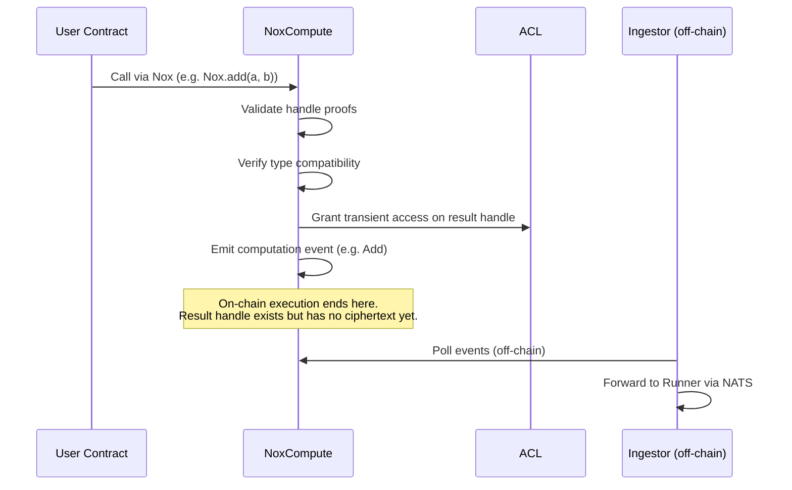

# Nox Smart Contracts

The on-chain layer of Nox consists of several Solidity contracts that manage
computation requests, access control, and protocol component registration.

## Role in the Protocol

Smart contracts are the on-chain entry point for all confidential operations.
Users call the `Nox` library from their contracts, which routes through the
`NoxCompute` contract. It validates handle proofs, verifies type compatibility
between operands, grants transient access on result handles, and emits events
that queue the computation for off-chain execution. At this point, the
transaction is complete on-chain but the encrypted result does not yet exist:
it will be computed by the [Runner](/protocol/runner) after the
[Ingestor](/protocol/ingestor) picks up the event.

## How It Works



::: info Handles are asynchronous pointers
A handle returned by `Nox.add(a, b)` is a deterministic identifier — not the
encrypted result. The actual computation happens off-chain after the
[Ingestor](/protocol/ingestor) picks up the event. The ciphertext will be
available in the [Gateway](/protocol/gateway) once the
[Runner](/protocol/runner) has processed it.
:::

## NoxCompute

The main entry point for confidential computations. It receives requests from
user contracts, validates handle proofs, emits events that trigger off-chain
computation, and manages the handle lifecycle.

### Handle Proof Validation

When a user submits a handle created off-chain, the contract verifies its
authenticity via an EIP-712 signed proof:

```
HandleProof(bytes32 handle, address owner, address app, uint256 createdAt)
```

**EIP-712 domain:**

| Field             | Value                       |
| ----------------- | --------------------------- |
| name              | `"NoxCompute"`              |
| version           | `"1"`                       |
| chainId           | Deployment chain ID         |
| verifyingContract | NoxCompute contract address |

### KMS Public Key

`NoxCompute` stores the KMS public key used by the protocol to encrypt
computation inputs for the Runner. It is set at deployment and can be queried
on-chain.

```solidity
function kmsPublicKey() external view returns (bytes memory);
```

### Nox Library

Smart contracts use the `Nox` library to interact with encrypted values. All
functions emit events that the [Ingestor](/protocol/ingestor) monitors to
trigger off-chain computation by the [Runner](/protocol/runner).

**Core functions:**

```solidity
// Encrypt plaintext into a handle
function plaintextToEncrypted(bytes32 value) returns (euint256);

// Arithmetic
function add(euint256 lhs, euint256 rhs) returns (euint256);
function sub(euint256 lhs, euint256 rhs) returns (euint256);
function mul(euint256 lhs, euint256 rhs) returns (euint256);
function div(euint256 lhs, euint256 rhs) returns (euint256);

// Safe arithmetic (returns overflow flag + result)
function safeAdd(euint256 lhs, euint256 rhs) returns (ebool, euint256);
function safeSub(euint256 lhs, euint256 rhs) returns (ebool, euint256);
function safeMul(euint256 lhs, euint256 rhs) returns (ebool, euint256);
function safeDiv(euint256 lhs, euint256 rhs) returns (ebool, euint256);

// Comparisons (return ebool)
function eq(euint256 lhs, euint256 rhs) returns (ebool);
function ne(euint256 lhs, euint256 rhs) returns (ebool);
function lt(euint256 lhs, euint256 rhs) returns (ebool);
function le(euint256 lhs, euint256 rhs) returns (ebool);
function gt(euint256 lhs, euint256 rhs) returns (ebool);
function ge(euint256 lhs, euint256 rhs) returns (ebool);

// Conditional selection
function select(ebool cond, euint256 ifTrue, euint256 ifFalse) returns (euint256);
```

**Advanced functions:**

```solidity
// Confidential token transfer
function transfer(address from, address to, euint256 amount)
    returns (euint256 newBalanceFrom, euint256 newBalanceTo, euint256 transferredAmount);

// Confidential mint
function mint(euint256 amount, euint256 balanceTo, euint256 totalSupply)
    returns (euint256 newBalanceTo, euint256 newTotalSupply);

// Confidential burn
function burn(euint256 amount, euint256 balanceFrom, euint256 totalSupply)
    returns (euint256 newBalanceFrom, euint256 newTotalSupply, euint256 burntAmount);
```

### Mixing Plaintext and Encrypted Values

All Nox operations require **both operands to be handles**. To combine an
encrypted value with a plaintext constant, first convert the plaintext to a
handle using `plaintextToEncrypted`:

```solidity
// Goal: compute encryptedBalance + 100
euint256 handleA = ...; // existing encrypted handle

// Step 1: wrap the plaintext constant into a handle
euint256 handleB = Nox.plaintextToEncrypted(bytes32(uint256(100)));

// Step 2: now both operands are handles
euint256 result = Nox.add(handleA, handleB);
```

`plaintextToEncrypted` emits its own event. The Runner encrypts the value
off-chain and stores it in the Gateway before it can be used as an operand.

::: info Roadmap
Native support for mixed operands (plaintext alongside encrypted handles, without
a prior conversion) is planned. See
[Protocol Vision — Solidity Library](/protocol/protocol-vision#solidity-library).
:::

### Encrypted Types

The protocol supports all standard Solidity types in encrypted form. The full
type mapping is defined in
[TypeUtils.sol](https://github.com/iExec-Nox/nox-contracts/blob/main/contracts/shared/TypeUtils.sol#L8).

## ACL (Access Control List)

Manages permissions for encrypted handles. Determines who can use a handle as
input to a computation and who can decrypt the associated data.

### Roles

| Role       | Capability                                    |
| ---------- | --------------------------------------------- |
| **Admin**  | Use handle as computation input, manage perms |
| **Viewer** | Decrypt the associated data                   |
| **Public** | Anyone can decrypt (if explicitly set)        |

### Key Functions

```solidity
// Grant persistent access
function allow(bytes32 handle, address account) external;

// Grant one-time access (cleared after use)
function allowTransient(bytes32 handle, address account) external;

// Check access
function isAllowed(bytes32 handle, address account) view returns (bool);

// Make handle publicly decryptable
function allowPublicDecryption(bytes32 handle) external;
```

### Transient vs. Persistent Access

When `NoxCompute` creates a result handle, it grants only **transient** access
to the calling contract. This is intentional for two reasons:

- **Gas efficiency**: writing persistent ACL entries for every intermediate
  result handle would be expensive. Transient access requires no storage write.
- **Separation of concerns**: `NoxCompute` has no knowledge of the application's
  access model. It is the responsibility of the calling contract to decide which
  handles need to persist and who should be allowed to use or decrypt them.

::: warning Persist the ACL or lose the handle
If your contract needs to reuse a result handle in a future transaction (store
it in state, pass it to another function, or allow a user to decrypt it), you
must explicitly grant persistent access before the transaction ends:

```solidity
euint256 result = Nox.add(a, b);
ACL.allow(euint256.unwrap(result), address(this)); // persist for your contract
ACL.addViewer(euint256.unwrap(result), user);       // allow user to decrypt
```

Without this, the handle reference will exist in state but nobody will have
permission to use it.
:::

## Handle Structure

A handle is a unique 32-byte identifier that references an encrypted value in
the protocol. It does not contain the ciphertext itself, but allows locating it
in the off-chain database and extracting its properties in O(1). A handle is
**deterministic**: the same operation on the same inputs always produces the
same handle.

```
[0---------------------25]   [26------29]   [30]   [31]
    prehandle (truncated)      Chain ID     Type   Version
```

The full type mapping (byte 30) is defined in
[TypeUtils.sol](https://github.com/iExec-Nox/nox-contracts/blob/main/contracts/shared/TypeUtils.sol#L8).

### Required Properties

- **Determinism**: same operation + same inputs + same chain = same handle
- **Cross-chain uniqueness**: the chain ID prevents handle reuse across chains
- **Deployment isolation**: the NoxCompute address is included in the hash,
  binding the handle to a specific protocol instance
- **Verifiable type**: the type can be extracted in O(1) without external calls
- **Versioning**: allows format evolution while maintaining backward
  compatibility

### Prehandle Construction

The prehandle is a keccak256 hash truncated to 26 bytes. Its computation differs
depending on the handle origin:

**Computation result** (on-chain, e.g. add, sub, transfer):

```solidity
bytes32 prehandle = keccak256(abi.encodePacked(
    operator,           // Operator enum (Add, Sub, Div, ...)
    operands,           // Array of input handles
    address(this),      // NoxCompute address
    msg.sender,         // Calling contract
    block.timestamp,
    outputIndex         // For multi-output operations (0, 1, ...)
));
```

**User input** (off-chain, via Gateway `POST /v0/secrets`):

```solidity
bytes32 prehandle = randomValue;
```

For user inputs, the prehandle is a random value generated by the Gateway. The
handle is then validated on-chain via an EIP-712 signed `HandleProof`.

## Learn More

- [Runner](/protocol/runner) - Executes the off-chain computations
- [Gateway](/protocol/gateway) - Manages encrypted handle data
- [Ingestor](/protocol/ingestor) - Monitors contract events
- [Global Architecture Overview](/protocol/global-architecture-overview)
