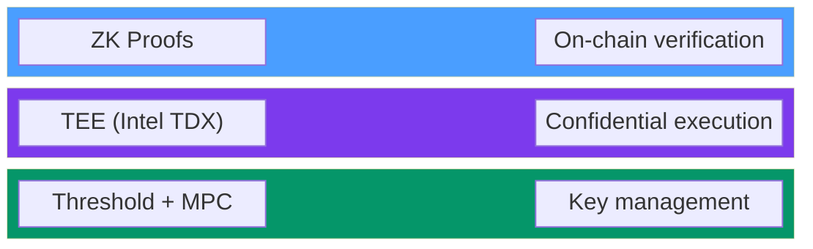
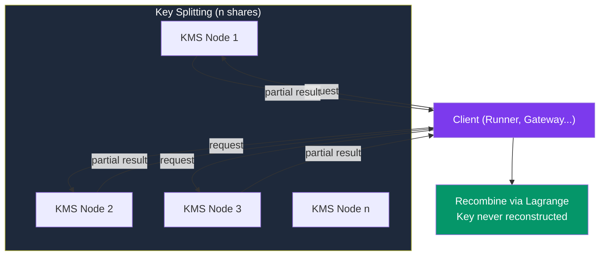
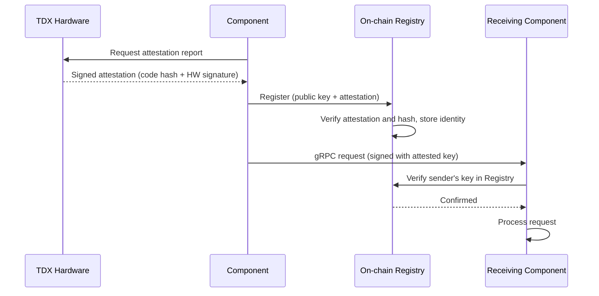
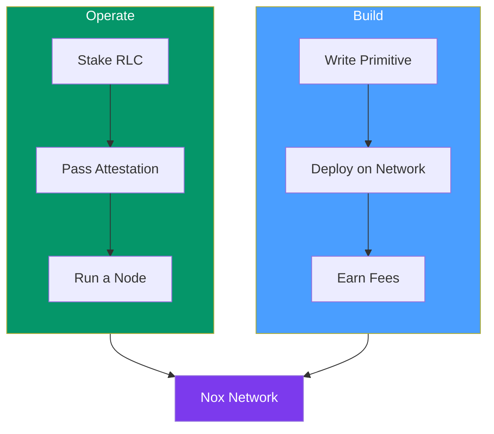
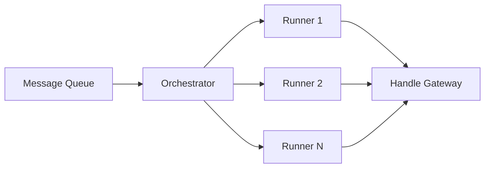
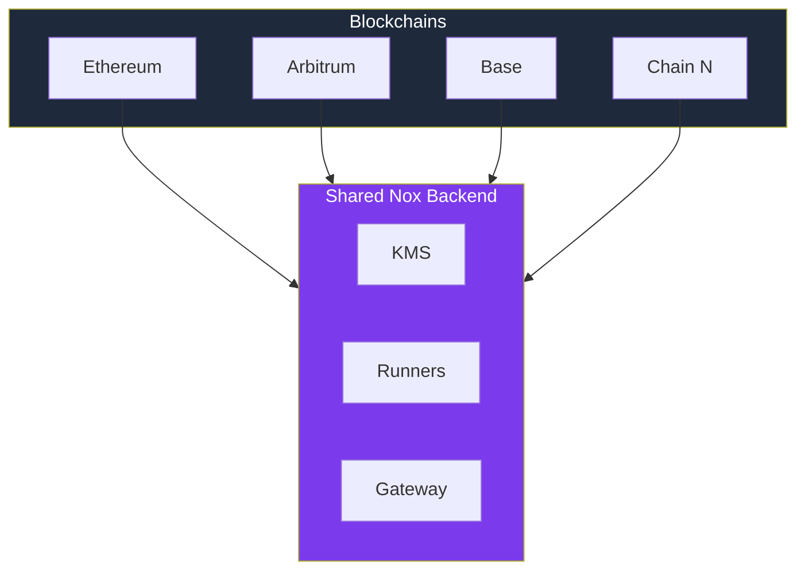

# Protocol Vision

Public-by-default transparency was a feature in early DeFi. At scale, it has
become a limitation. On fully transparent blockchains, strategies, positions,
and capital flows are publicly exposed. Professional allocators suffer from
copy-trading, MEV extraction, and poor execution. Institutions and RWA issuers
cannot operate under full on-chain disclosure. DeFi lacks a confidential asset
primitive that preserves composability while meeting real-world financial
constraints.

Nox fills this gap: a privacy layer that brings confidentiality to DeFi without
sacrificing the composability and decentralization that make it powerful.

The long-term vision for Nox evolves the protocol along six axes:

- **Privacy by convergence**: combine TEE, threshold cryptography, MPC, and
  zero-knowledge proofs, each applied where it offers the best tradeoff
- **Trust distribution**: progressively reduce trust assumptions by distributing
  and decentralizing components
- **Omnichain expansion**: extend Nox to any EVM chain, sharing a single backend
  across all supported networks
- **Horizontal scalability**: support multiple Runners and growing computation
  throughput
- **Composability**: enable confidential tokens to interact with the entire DeFi
  ecosystem, confidential or not
- **Developer openness**: allow anyone to create, deploy, and monetize new
  confidential computation primitives

## Privacy by Convergence

No single privacy technology solves confidential DeFi alone. TEEs are fast but
rely on hardware trust. Threshold cryptography distributes trust but cannot
execute arbitrary computation. MPC enables collaborative computation but does
not scale to complex workloads. Zero-knowledge proofs offer mathematical
guarantees but are too expensive for general-purpose execution.

Each technology excels in a specific domain and fails in others. The only path
to a privacy layer that is simultaneously fast, trustless, and scalable is to
combine them, using each where it is strongest:

| Technology                        | Where it applies               | Strength                                                                          |
| --------------------------------- | ------------------------------ | --------------------------------------------------------------------------------- |
| **TEE (Intel TDX)**               | Runner, Gateway, Ingestor, KMS | Fast computation on encrypted data inside hardware-isolated enclaves              |
| **Threshold cryptography**        | KMS                            | Distributed key management with no single point of trust                          |
| **MPC (Multi-Party Computation)** | KMS                            | Collaborative computation across multiple nodes without reconstructing secrets    |
| **ZK (Zero-Knowledge Proofs)**    | On-chain verification          | Gas-efficient proof verification, replacing expensive on-chain verification logic |

Together, these technologies cover each other's weaknesses:

- **TEE** provides the execution environment: Runners decrypt, compute, and
  re-encrypt data inside hardware enclaves, ensuring that plaintext never leaves
  protected memory
- **Threshold cryptography and MPC** remove the hardware single point of trust:
  the protocol's private key is distributed across KMS nodes, and decryption
  delegation happens without ever reconstructing the complete key, so even a TEE
  compromise does not expose all secrets
- **ZK proofs** make it scalable on-chain: instead of performing expensive
  verification logic on-chain, the protocol can submit compact proofs that are
  cheap to verify, allowing throughput to grow without proportionally increasing
  gas fees

## No Single Key, No Single Point of Failure

The protocol's private key is Nox's most sensitive asset: whoever holds it can
decrypt every handle in the system. In the current version, a single KMS node
holds this key. The target architecture eliminates this single point of trust
through **threshold cryptography**.

The private key is split into **n shares** using
[Shamir's Secret Sharing](https://en.wikipedia.org/wiki/Shamir%27s_secret_sharing)
(SSS), a scheme where a random polynomial of degree `t-1` encodes the secret as
its constant term. Each KMS node receives one share (a point on the polynomial).
At least **t nodes** must collaborate to perform any cryptographic operation.
Fewer than `t` shares reveal nothing about the private key.

The critical property is that the private key is **never reconstructed**. During
decryption delegation, each KMS node computes a partial result using its own
share, and the requesting party recombines the partial results via Lagrange
interpolation. No individual node, and no network message, ever contains the
complete key.

### Key Rotation

A threshold architecture also enables **safe key rotation** without service
interruption. When the protocol's private key needs to be replaced (scheduled
rotation, node compromise, or algorithm migration), the new key shares can be
distributed to KMS nodes through a proactive secret sharing protocol: each node
receives a new share derived from the existing ones without ever exposing the
current private key. All existing ciphertexts are re-encrypted under the new key
as part of the rotation process. The on-chain Registry is updated atomically,
ensuring that no request is processed with a stale key.

### Algorithm Evolution

The current implementation uses ECIES on secp256k1. The target architecture
plans to migrate toward **post-quantum algorithms standardized by NIST**:

- **[ML-KEM](https://csrc.nist.gov/pubs/fips/203/final)** (FIPS 203, formerly
  CRYSTALS-Kyber) for encryption: handles are encrypted using a lattice-based
  key encapsulation mechanism resistant to quantum attacks
- **[ML-DSA](https://csrc.nist.gov/pubs/fips/204/final)** (FIPS 204, formerly
  CRYSTALS-Dilithium) for signatures: component attestations and message
  authentication use a quantum-resistant signature scheme

ML-KEM is operated in **MPC threshold mode** for decryption: each KMS node
participates in the key decapsulation using its own share, and the result is
reconstructed without any node learning the plaintext or the full private key.
This combines the long-term security guarantees of post-quantum cryptography
with the trust distribution properties of threshold cryptography.

## Hardware-Rooted Chain of Trust

Before the protocol can allow third parties to operate components, it must
guarantee that each component runs legitimate code, inside a genuine hardware
enclave, and that this trust persists over time. The Nox chain of trust rests on
three pillars: **code integrity verification**, **physical infrastructure
verification**, and **controlled code evolution**.

### Proving Every Byte

Each component (Runner, KMS node, Gateway, Ingestor) runs inside an **Intel TDX
enclave**. Before joining the protocol, each component goes through four
verification steps:

1. **Code hash stored on-chain**: the exact hash of the authorized binary is
   recorded in the on-chain Registry. Only code whose hash matches can be
   accepted by the protocol
2. **Remote Attestation (RA)**: the TDX hardware generates a signed attestation
   report, proving that the execution environment is genuine, that the running
   code matches the expected hash, and that the enclave state has not been
   tampered with
3. **On-chain registration**: the attestation report is verified and the
   component's identity (public key + attestation hash) is recorded in the
   on-chain **Registry** contract
4. **Runtime authentication**: components communicate via **gRPC**, signing
   every message with the attested private key. The receiving component verifies
   the signature against the on-chain Registry, confirming that the sender has
   been properly attested

### Proof of Cloud: Proving Where It Runs

TEE attestation proves **what** code is running, but not **where** it is
running. An operator with physical access to the hardware could attempt attacks
that fall outside the TEE's threat model (side-channel attacks, voltage
glitching, cold-boot attacks). Proof of Cloud closes this gap by
cryptographically verifying that the hardware is located in a certified cloud
provider's data center where the operator has no physical access.

The mechanism binds TEE attestation to the physical platform through two
independent roots of trust:

1. **TEE root of trust** (CPU-level): Intel TDX provides attestation of the
   confidential VM's code and data
2. **Platform root of trust** (TPM-level): a Trusted Platform Module on the
   physical server seals attestation keys to specific platform measurements,
   creating a cryptographic binding between the workload and the physical
   machine it runs on

A public, append-only registry maps hardware identifiers to verified cloud
facilities. If an operator attempted to relocate a workload to hardware they
physically control, the attestation binding would break: the TPM measurements
would mismatch, and the registry lookup would reveal that the hardware does not
belong to a verified data center.

The result: even a fully malicious operator is limited to a software-only
adversary role. They control the host OS and hypervisor, but they have no path
to plaintext data because they lack physical access to the TEE hardware, and
this physical separation is cryptographically verifiable rather than merely
assumed.

### Upgrading Without Breaking Trust

The protocol must be able to evolve (bug fixes, new features, optimizations)
while keeping the chain of trust intact. The target architecture governs
upgrades through three mechanisms:

- **On-chain governance**: any update to the authorized code hash goes through
  an on-chain governance process, ensuring that no individual operator can
  unilaterally change the code running on the network
- **Reproducible builds**: component binaries are built deterministically
  (reproducible builds), allowing anyone to verify that the on-chain hash
  matches the public source code
- **Transition period**: during an upgrade, the old and new hashes coexist for a
  defined period, giving operators time to migrate their nodes without service
  interruption

This creates an unbroken **chain of trust**: from hardware attestation, through
on-chain registration, through verified physical location, to runtime
communication. No component can participate in the protocol without first
proving its integrity and its physical environment, and every message between
components is cryptographically tied to that proof.

## Open and Permissionless

With the chain of trust in place, the protocol no longer needs a single trusted
operator. Nox is designed to be permissionless at every level: anyone can
operate infrastructure, and anyone can extend the protocol with new
functionality.

### Become an Operator

Any party can run any type of component (Runner, Ingestor, KMS node, Gateway),
provided they:

1. Pass remote attestation (proving they run legitimate code inside a genuine
   TEE)
2. Stake **RLC tokens** as economic collateral

Staking ensures that operators have skin in the game. Malicious or negligent
behavior (submitting incorrect results, going offline, attempting to forge
attestations) triggers **slashing**: partial or total loss of staked tokens.

Every component type can be operated by independent parties, making the protocol
progressively decentralized as new operators join the network.

### Build, Deploy, Monetize

The protocol is not meant to implement every possible confidential operation.
The target architecture opens the development of **computation primitives** to
the community: any developer can create new operations on encrypted data, deploy
them on the network, and monetize them.

A computation primitive is an operation executed by Runners inside the TEE: it
receives encrypted handles as input, performs a computation on the plaintext
inside the enclave, and produces new encrypted handles as output. The developer
defines the logic, the protocol guarantees confidentiality and execution
integrity.

This openness applies to both infrastructure and innovation: operators earn by
running the network, developers earn by extending it.

### Solidity Library

The primary developer surface for Nox is the
[Solidity Library](/references/solidity-library): a set of Solidity types and
functions that expose the protocol's computation primitives directly in smart
contract code. Developers interact with encrypted values through opaque handles
(`euint256`, `ebool`, etc.) without ever manipulating ciphertexts directly.

The library's current model requires all operands to be handles, including
plaintext constants (which must first be converted via `plaintextToEncrypted`).
A planned evolution is to support **mixed operand operations** natively,
allowing a plaintext value to be passed directly alongside an encrypted handle
without a prior conversion step. This removes boilerplate and makes confidential
arithmetic feel as natural as standard Solidity.

## Scale Out, Not Up

The current version runs a single Runner processing computation requests
sequentially. The target architecture scales horizontally with **multiple
Runners** coordinated by a **TDX Orchestrator**.

The Orchestrator is itself a TEE-attested component that:

- **Dequeues** computation requests from the message queue
- **Assigns** each request to an available Runner
- **Monitors** Runner availability and execution progress
- **Reassigns** tasks if a Runner fails or times out

Runners are distributed among independent operators, each running inside its own
Intel TDX enclave. This allows the protocol to scale throughput linearly with
the number of Runners, while the Orchestrator ensures that every computation
request is eventually processed.

## Every Chain, One Privacy Layer

The handle structure already encodes a **4-byte chain ID** (bytes 26-29),
ensuring that handles are bound to a specific chain and cannot be reused across
chains. This makes omnichain support a natural extension of the architecture
rather than a protocol redesign.

The goal is to let Nox secure confidential data on any blockchain while sharing
backend infrastructure. Extending Nox to a new chain requires deploying the
on-chain contracts on the target chain and adapting the backend components that
interact with the blockchain (event monitoring, transaction submission, chain ID
routing). The protocol core (encryption, key management, computation execution)
remains shared and agnostic to the data's chain of origin.

This shared infrastructure means that adding a new chain does not require
duplicating the entire backend, allowing the protocol to expand to new chains
with marginal operational cost.

## Private Tokens Meet Public DeFi

Confidentiality is only valuable if it integrates with the existing ecosystem. A
confidential token isolated from the rest of DeFi would be unusable. Nox's
vision is to make confidential tokens **composable** with the entire DeFi
ecosystem, whether confidential or not.

In practice, this means enabling a Nox confidential token to be used as
collateral in a lending protocol, swapped on a DEX, or deposited into a yield
vault, even when those protocols do not natively support confidentiality. The
protocol manages the transition between the confidential and non-confidential
worlds transparently, decrypting only the information strictly necessary for
interaction with the target protocol.

This composability also extends to confidential DeFi (cDeFi) protocols, enabling
interactions between different privacy layers and creating a unified ecosystem
where confidentiality is a spectrum rather than a binary choice.

## Learn More

- [KMS](/protocol/kms) - Cryptographic protocol and threshold architecture
- [Runner](/protocol/runner) - Computation engine
- [Global Architecture Overview](/protocol/global-architecture-overview) - Full
  component descriptions and data flows
