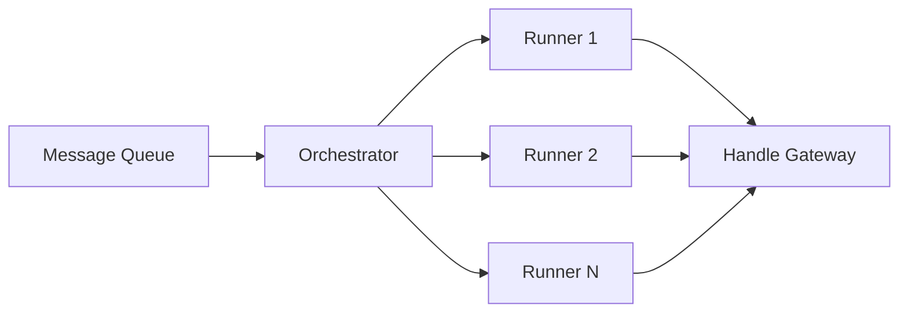

# Protocol Vision

The current Nox implementation is a functional MVP where a single operator runs
all components and a single KMS node holds the full protocol private key. The
long-term architecture evolves the protocol along three axes:

- **Trust distribution**: eliminate every single point of trust by distributing
  keys and decentralizing operations
- **Horizontal scaling**: support multiple Runners, multiple chains, and
  increasing throughput
- **Privacy depth**: combine TEE, threshold cryptography, MPC, and
  zero-knowledge proofs, each applied where it provides the best tradeoff

## Distributed Key Management

The protocol private key is the most sensitive asset in Nox: whoever holds it
can decrypt every handle in the system. In the MVP, a single KMS node holds this
key. The target architecture eliminates this single point of trust using
**threshold cryptography**.

The private key is split into **n shares** using
[Shamir's Secret Sharing](https://en.wikipedia.org/wiki/Shamir%27s_secret_sharing)
(SSS), a scheme where a random polynomial of degree `t-1` encodes the secret as
its constant term. Each KMS node receives one share (one point on the
polynomial). At least **t nodes** must collaborate to perform any cryptographic
operation. Fewer than `t` shares reveal nothing about the private key.

The critical property is that the private key is **never reconstructed**. During
decryption delegation, each KMS node computes a partial result using its own
share, and the requesting party recombines the partial results via Lagrange
interpolation. No single node, and no network message, ever contains the full
key.

For the detailed cryptographic protocol (ECIES, HKDF parameters, delegation
flow), see the [KMS](/protocol/kms) page.

## Remote Attestation and Chain of Trust

Before the protocol can allow third parties to operate components, it needs a
way to verify that each component runs legitimate, unmodified code inside a
genuine hardware enclave. This is the role of **remote attestation** (RA).

Every component (Runner, KMS node, Gateway, Ingestor) runs inside an **Intel TDX
enclave**. Before joining the protocol, each component must:

1. **Generate an attestation report** proving that specific, unmodified code is
   running inside a genuine TDX enclave. The report is signed by the hardware
   itself and cannot be forged
2. **Register on-chain**: the attestation report is verified and the component's
   identity (public key + attestation hash) is recorded in the on-chain
   **Registry** contract
3. **Authenticate every message**: components communicate via **gRPC**, signing
   each message with the private key that was attested during registration
4. **Verify the sender on reception**: the receiving component checks the
   message signature against the on-chain Registry, confirming that the sender
   was properly attested

This creates an unbroken **chain of trust**: from hardware attestation, through
on-chain registration, to runtime communication. No component can participate in
the protocol without first proving its integrity, and every message between
components is cryptographically linked to that proof.

## Decentralized Operations

With remote attestation in place, the protocol no longer needs a single trusted
operator. Any party can run any component type, provided they:

1. Pass remote attestation (proving they run legitimate code in a genuine TEE)
2. Stake **RLC tokens** as economic collateral

Staking ensures that operators have financial skin in the game. Malicious or
negligent behavior (submitting incorrect results, going offline, attempting to
tamper with attestations) results in **slashing**: partial or total loss of the
staked tokens.

The on-chain **Registry** manages the full lifecycle of each component:

| Aspect          | Mechanism                                                    |
| --------------- | ------------------------------------------------------------ |
| **Identity**    | Public key registered alongside attestation proof            |
| **Attestation** | Verified on-chain before the component can participate       |
| **Stake**       | RLC deposit required, locked for the duration of service     |
| **Liveness**    | Monitored by the Orchestrator, timeout triggers reassignment |
| **Slashing**    | Triggered by provable misbehavior or prolonged downtime      |
| **Governance**  | Protocol governance can revoke compromised components        |

Each component type (Runner, Ingestor, KMS node, Gateway) can be operated by
independent parties, making the protocol progressively decentralized as more
operators join.

## Multi-Runner Architecture

The MVP runs a single Runner processing computation requests sequentially. The
target architecture scales horizontally with **multiple Runners** coordinated by
a **TDX Orchestrator**.

The Orchestrator is itself a TEE-attested component that:

- **Dequeues** computation requests from the message queue
- **Assigns** each request to an available Runner
- **Monitors** Runner liveness and execution progress
- **Reassigns** tasks if a Runner fails or times out

Runners are distributed across independent operators, each running in their own
Intel TDX enclave. This enables the protocol to scale throughput linearly with
the number of Runners, while the Orchestrator ensures that every computation
request is eventually processed.

## Multichain Support

The handle structure already encodes a **4-byte chain ID** (bytes 26-29),
ensuring that handles are bound to a specific chain and cannot be reused across
chains. This makes multichain support a deployment concern rather than a
protocol redesign.

Extending Nox to a new chain requires:

- Deploying **TEEComputeManager** and **ACL** contracts on the target chain
- Configuring additional Ingestor instances to monitor the new chain
- Routing computation requests to the same Runner pool (Runners are
  chain-agnostic, they operate on encrypted data regardless of origin)

The shared KMS and Runner infrastructure means that adding a new chain does not
require duplicating the entire backend: only the on-chain contracts and
blockchain monitoring are chain-specific.

## Multi-Privacy Technologies

The long-term architecture combines four complementary privacy technologies,
each applied where it provides the best tradeoff between performance, trust
assumptions, and cost:

| Technology                        | Where it applies          | Why                                                                            |
| --------------------------------- | ------------------------- | ------------------------------------------------------------------------------ |
| **TEE (Intel TDX)**               | Runner, Gateway, Ingestor | Fast computation on encrypted data in hardware-isolated enclaves               |
| **Threshold cryptography**        | KMS                       | Distributed key management with no single point of trust                       |
| **MPC (Multi-Party Computation)** | KMS                       | Collaborative computation across multiple nodes without reconstructing secrets |
| **ZK (Zero-Knowledge Proofs)**    | On-chain verification     | Gas-efficient proof verification, replacing costly on-chain checks             |

These technologies reinforce each other:

- **TEE** provides the execution environment: Runners decrypt, compute, and
  re-encrypt data inside hardware enclaves, ensuring that plaintext never leaves
  protected memory
- **Threshold cryptography and MPC** secure key management: the protocol private
  key is distributed across KMS nodes, and decryption delegation happens without
  ever reconstructing the full key
- **ZK proofs** optimize on-chain costs: instead of performing expensive
  verification logic on-chain, the protocol can submit compact proofs that are
  cheap to verify, allowing throughput to scale without proportionally
  increasing gas fees

## Learn More

- [KMS](/protocol/kms) - Cryptographic protocol and threshold architecture
- [Runner](/protocol/runner) - Computation engine
- [Global Architecture Overview](/protocol/global-architecture-overview) - Full
  component descriptions and data flows
