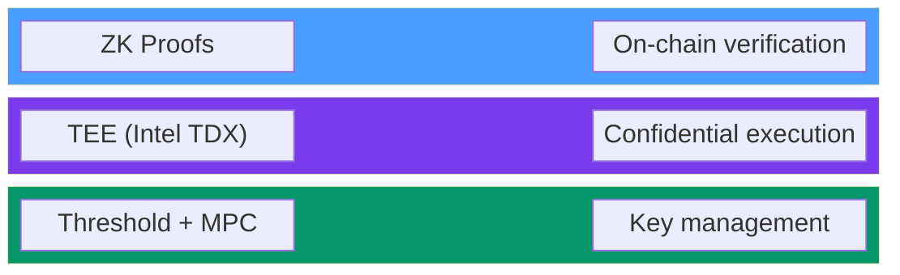
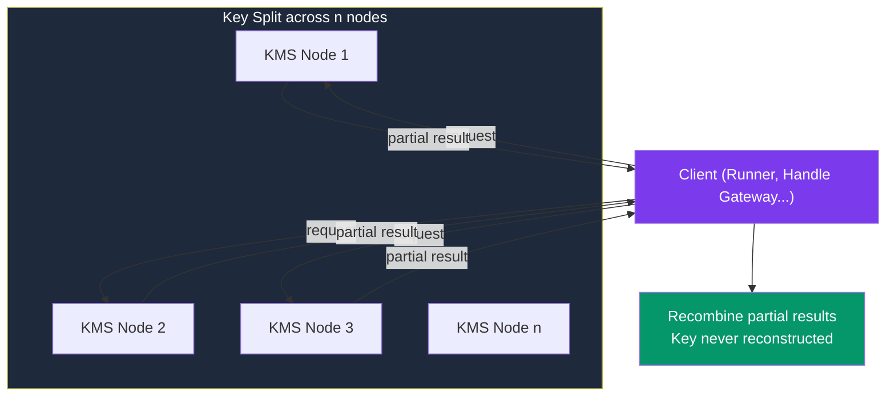
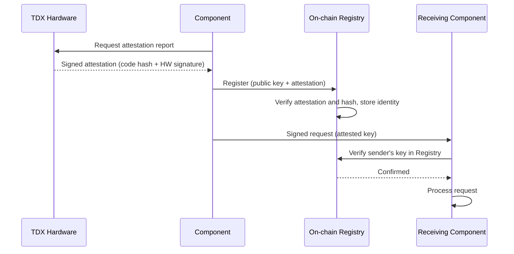
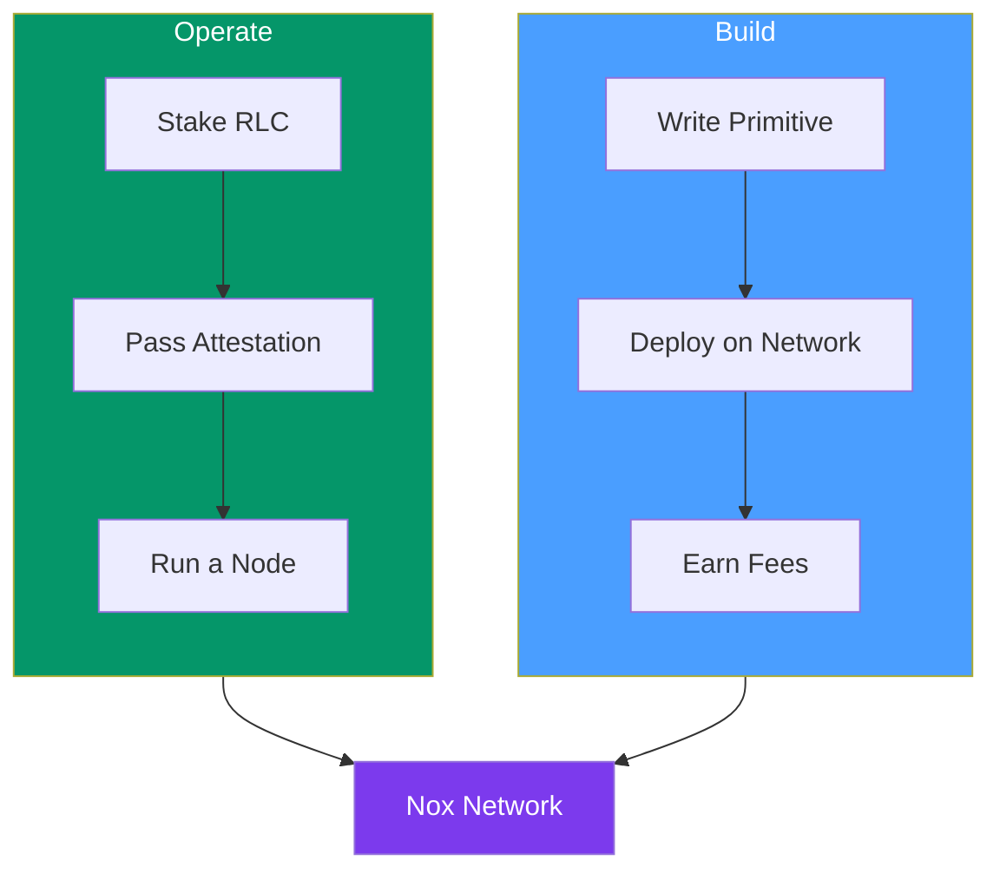
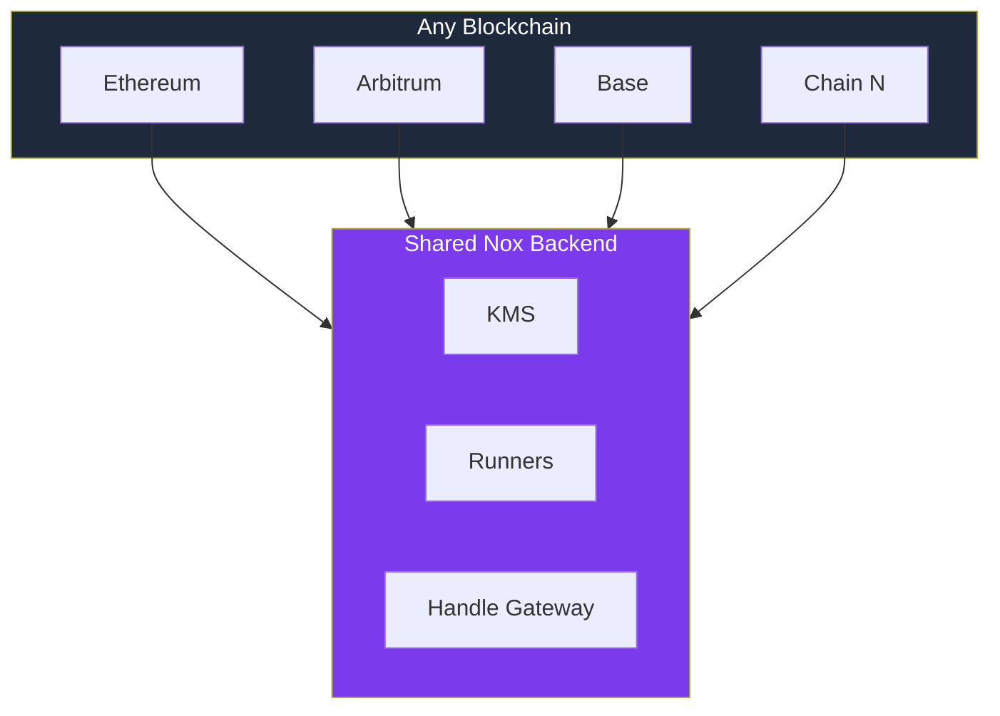

# Protocol Vision

Public-by-default transparency was a feature in early DeFi. At scale, it has
become a limitation. On fully transparent blockchains, strategies, positions,
and capital flows are publicly exposed. Professional allocators suffer from
copy-trading, MEV extraction, and poor execution. Institutions and RWA issuers
cannot operate under full on-chain disclosure. DeFi lacks a confidential asset
primitive that preserves composability while meeting real-world financial
constraints.

Nox fills this gap: a privacy layer that brings confidentiality to DeFi without
sacrificing the composability and decentralization that make it powerful.

The long-term vision for Nox evolves the protocol along six axes. This page
reflects the current direction of the protocol: the architecture and priorities
described here are subject to change as the technology and ecosystem mature.

- **Privacy by convergence**: combine TEE, threshold cryptography, MPC, and
  zero-knowledge proofs, each applied where it offers the best tradeoff
- **Trust distribution**: progressively reduce trust assumptions by distributing
  and decentralizing components
- **Omnichain expansion**: extend Nox to any blockchain, sharing a single
  backend across all supported networks
- **Horizontal scalability**: support multiple Runners and growing computation
  throughput
- **Composability**: enable confidential tokens to interact with the entire DeFi
  ecosystem, confidential or not
- **Developer openness**: allow anyone to create, deploy, and monetize new
  confidential computation primitives
- **Developer experience**: make confidential computing as accessible as
  standard Solidity development

## Combining Privacy Technologies

```mermaid
block-beta
    columns 3
    block:onchain:3
        columns 3
        zk["ZK Proofs"]
        space
        onlabel["On-chain verification"]
    end
    block:exec:3
        columns 3
        tee["TEE (Intel TDX)"]
        space
        execlabel["Confidential execution"]
    end
    block:keys:3
        columns 3
        threshold["Threshold + MPC"]
        space
        keyslabel["Key management"]
    end

    style onchain fill:#4a9eff,color:#fff
    style exec fill:#7c3aed,color:#fff
    style keys fill:#059669,color:#fff
```

No single privacy technology solves confidential DeFi alone. TEEs are fast but
rely on hardware trust. Threshold cryptography distributes trust but cannot
execute arbitrary computation. MPC enables collaborative computation but does
not scale to complex workloads. Zero-knowledge proofs offer mathematical
guarantees but are too expensive for general-purpose execution.

Each technology excels in a specific domain and fails in others. The only path
to a privacy layer that is simultaneously fast, trustless, and scalable is to
combine them, using each where it is strongest:

| Technology                        | Where it applies                      | Strength                                                                          |
| --------------------------------- | ------------------------------------- | --------------------------------------------------------------------------------- |
| **TEE (Intel TDX)**               | Runner, Handle Gateway, Ingestor, KMS | Fast computation on encrypted data inside hardware-isolated enclaves              |
| **Threshold cryptography**        | KMS                                   | Distributed key management with no single point of trust                          |
| **MPC (Multi-Party Computation)** | KMS                                   | Collaborative computation across multiple nodes without reconstructing secrets    |
| **ZK (Zero-Knowledge Proofs)**    | On-chain verification                 | Gas-efficient proof verification, replacing expensive on-chain verification logic |

Together, these technologies cover each other's weaknesses:

- **TEE** provides the execution environment: Runners decrypt, compute, and
  re-encrypt data inside hardware enclaves, ensuring that plaintext never leaves
  protected memory
- **Threshold cryptography and MPC** remove the hardware single point of trust:
  the protocol's private key is distributed across KMS nodes, and decryption
  delegation happens without ever reconstructing the complete key, so even a TEE
  compromise does not expose all secrets
- **ZK proofs** make it scalable on-chain: instead of performing expensive
  verification logic on-chain, the protocol can submit compact proofs that are
  cheap to verify, allowing throughput to grow without proportionally increasing
  gas fees

## Distributed Key Management

### Quantum-Resistant Cryptography

The current implementation uses ECIES on secp256k1. The target architecture
plans to migrate toward **quantum-resistant algorithms**, ensuring long-term
security of encrypted handles.

### Threshold Distribution

```mermaid
flowchart TB
    subgraph split ["Key Split across n nodes"]
        direction LR
        S1["KMS Node 1"]
        S2["KMS Node 2"]
        S3["KMS Node 3"]
        SN["KMS Node n"]
    end

    Client["Client (Runner, Handle Gateway...)"]

    Client --> |request| S1
    Client --> |request| S2
    Client --> |request| S3

    S1 --> |partial result| Client
    S2 --> |partial result| Client
    S3 --> |partial result| Client

    Client --> OUT["Recombine partial results<br/>Key never reconstructed"]

    style split fill:#1e293b,color:#fff
    style Client fill:#7c3aed,color:#fff
    style OUT fill:#059669,color:#fff
```

The protocol's private key is Nox's most sensitive asset: whoever holds it can
decrypt every handle in the system. The target architecture eliminates this
single point of trust through **threshold cryptography**: the key is split
across **n KMS nodes**, and at least **t nodes** must collaborate to perform any
cryptographic operation. The full key is never reconstructed anywhere, not on
any node, not in any message.

### Key Rotation

A threshold architecture also enables **safe key rotation** without service
interruption: key shares can be refreshed across nodes without ever exposing the
current private key, and existing ciphertexts are re-encrypted under the new key
as part of the process.

## Every Component Is Verified

Before the protocol can allow third parties to operate components, it must
guarantee that each component runs legitimate code, inside a genuine hardware
TEE, and that this trust persists over time. The Nox chain of trust rests on
three pillars: **code integrity verification**, **physical infrastructure
verification**, and **controlled code evolution**.

### Code Integrity

Each component (Runner, KMS node, Handle Gateway, Ingestor) runs inside an
**Intel TDX TEE**. Before joining the protocol, each component goes through four
verification steps:

1. **Code hash stored on-chain**: the exact hash of the authorized binary is
   recorded in the on-chain Registry. Only code whose hash matches can be
   accepted by the protocol
2. **Remote Attestation (RA)**: the TDX hardware generates a signed attestation
   report, proving that the execution environment is genuine, that the running
   code matches the expected hash, and that the TEE state has not been tampered
   with
3. **On-chain registration**: the attestation report is verified and the
   component's identity (public key + attestation hash) is recorded in the
   on-chain **Registry** contract
4. **Runtime authentication**: components communicate by signing every message
   with the attested private key. The receiving component verifies the signature
   against the on-chain Registry, confirming that the sender has been properly
   attested

```mermaid
sequenceDiagram
    participant HW as TDX Hardware
    participant C as Component
    participant BC as On-chain Registry
    participant R as Receiving Component

    C->>HW: Request attestation report
    HW-->>C: Signed attestation (code hash + HW signature)
    C->>BC: Register (public key + attestation)
    BC->>BC: Verify attestation and hash, store identity
    C->>R: Signed request (attested key)
    R->>BC: Verify sender's key in Registry
    BC-->>R: Confirmed
    R->>R: Process request
```

### Proof of Cloud: Physical Location Verification

TEE attestation proves **what** code is running, but not **where** it is
running. An operator with physical access to the hardware could attempt attacks
that fall outside the TEE's threat model (side-channel attacks, voltage
glitching, cold-boot attacks). Proof of Cloud closes this gap by
cryptographically verifying that the hardware is located in a certified cloud
provider's data center where the operator has no physical access.

The mechanism binds TEE attestation to the physical platform through two
independent roots of trust:

1. **TEE root of trust** (CPU-level): Intel TDX provides attestation of the
   confidential VM's code and data
2. **Platform root of trust** (TPM-level): a Trusted Platform Module on the
   physical server seals attestation keys to specific platform measurements,
   creating a cryptographic binding between the workload and the physical
   machine it runs on

A public, append-only registry maps hardware identifiers to verified cloud
facilities. If an operator attempted to relocate a workload to hardware they
physically control, the attestation binding would break: the TPM measurements
would mismatch, and the registry lookup would reveal that the hardware does not
belong to a verified data center.

The result: even a fully malicious operator is limited to a software-only
adversary role. They control the host OS and hypervisor, but they have no path
to plaintext data because they lack physical access to the TEE hardware, and
this physical separation is cryptographically verifiable rather than merely
assumed.

### Governed Upgrades

The protocol must be able to evolve (bug fixes, new features, optimizations)
while keeping the chain of trust intact. The target architecture governs
upgrades through three mechanisms:

- **On-chain governance**: any update to the authorized code hash goes through
  an on-chain governance process, ensuring that no individual operator can
  unilaterally change the code running on the network
- **Reproducible builds**: component binaries are built deterministically
  (reproducible builds), allowing anyone to verify that the on-chain hash
  matches the public source code
- **Transition period**: during an upgrade, the old and new hashes coexist for a
  defined period, giving operators time to migrate their nodes without service
  interruption

This creates an unbroken **chain of trust**: from hardware attestation, through
on-chain registration, through verified physical location, to runtime
communication. No component can participate in the protocol without first
proving its integrity and its physical environment, and every message between
components is cryptographically tied to that proof.

## Open and Permissionless

```mermaid
flowchart TB
    subgraph operators ["Operate"]
        direction TB
        O1["Stake RLC"] --> O2["Pass Attestation"] --> O3["Run a Node"]
    end

    subgraph developers ["Build"]
        direction TB
        D1["Write Primitive"] --> D2["Deploy on Network"] --> D3["Earn Fees"]
    end

    operators --> N["Nox Network"]
    developers --> N

    style operators fill:#059669,color:#fff
    style developers fill:#4a9eff,color:#fff
    style N fill:#7c3aed,color:#fff
```

With the chain of trust in place, the protocol no longer needs a single trusted
operator. Nox is designed to be permissionless at every level: anyone can
operate infrastructure, and anyone can extend the protocol with new
functionality.

### Run the Network

Any party can run any type of component (Runner, Ingestor, KMS node, Haneld
Gateway), provided they:

1. Pass remote attestation (proving they run legitimate code inside a genuine
   TEE)
2. Stake **RLC tokens** as economic collateral

Staking ensures that operators have skin in the game. Malicious or negligent
behavior (submitting incorrect results, going offline, attempting to forge
attestations) triggers **slashing**: partial or total loss of staked tokens.

Every component type can be operated by independent parties, making the protocol
progressively decentralized as new operators join the network.

### Extend the Protocol

The protocol is not meant to implement every possible confidential operation.
The target architecture opens the development of **computation primitives** to
the community: any developer can create new operations on encrypted data, deploy
them on the network, and monetize them.

A computation primitive is an operation executed by Runners inside the TEE: it
receives encrypted handles as input, performs a computation on the plaintext
inside the TEE, and produces new encrypted handles as output. The developer
defines the logic, the protocol guarantees confidentiality and execution
integrity.

This openness applies to both infrastructure and innovation: operators earn by
running the network, developers earn by extending it.

## One Privacy Layer, Every Chain

```mermaid
flowchart TB
    subgraph chains ["Any Blockchain"]
        direction LR
        C1["Ethereum"]
        C2["Arbitrum"]
        C3["Base"]
        CN["Chain N"]
    end

    subgraph nox ["Shared Nox Backend"]
        direction LR
        KMS["KMS"]
        Runners["Runners"]
        GW["Handle Gateway"]
    end

    C1 --> nox
    C2 --> nox
    C3 --> nox
    CN --> nox

    style chains fill:#1e293b,color:#fff
    style nox fill:#7c3aed,color:#fff
```

The target architecture extends Nox to any blockchain through a single shared
backend: the same KMS, Runners, and Handle Gateway serve all supported networks.
Adding a new chain requires only deploying the on-chain contracts on the target
network. The protocol core (encryption, key management, computation) remains
shared and chain-agnostic.

Throughput scales horizontally: multiple Runners operated by independent
operators process computation requests in parallel, allowing capacity to grow
with demand without any single point of bottleneck.

## Developer Experience

Confidential computing should feel like standard Solidity development. The
target architecture invests in tooling and SDK improvements to remove friction
at every step of the developer workflow.

### Solidity Library

Developers interact with encrypted values through opaque handles (`euint256`,
`ebool`, etc.) without ever manipulating ciphertexts directly. The current model
requires all operands to be handles, including plaintext constants (which must
first be converted via `plaintextToEncrypted`). A planned evolution is to
support **mixed operand operations** natively, allowing a plaintext value to be
passed directly alongside an encrypted handle without a prior conversion step.
This removes boilerplate and makes confidential arithmetic feel as natural as
standard Solidity.

### Hardhat and Foundry Plugins

The target architecture provides first-class plugin support for the two dominant
Solidity development frameworks. Developers will be able to write, test, and
debug contracts using encrypted types directly within their existing Hardhat or
Foundry workflows, without setting up a separate environment or relying on
manual mocking of encrypted values.

## Learn More

- [Global Architecture Overview](/protocol/global-architecture-overview) - Full
  component descriptions and data flows
- [Runner](/protocol/runner) - Computation engine
- [KMS](/protocol/kms) - Cryptographic protocol and threshold architecture
