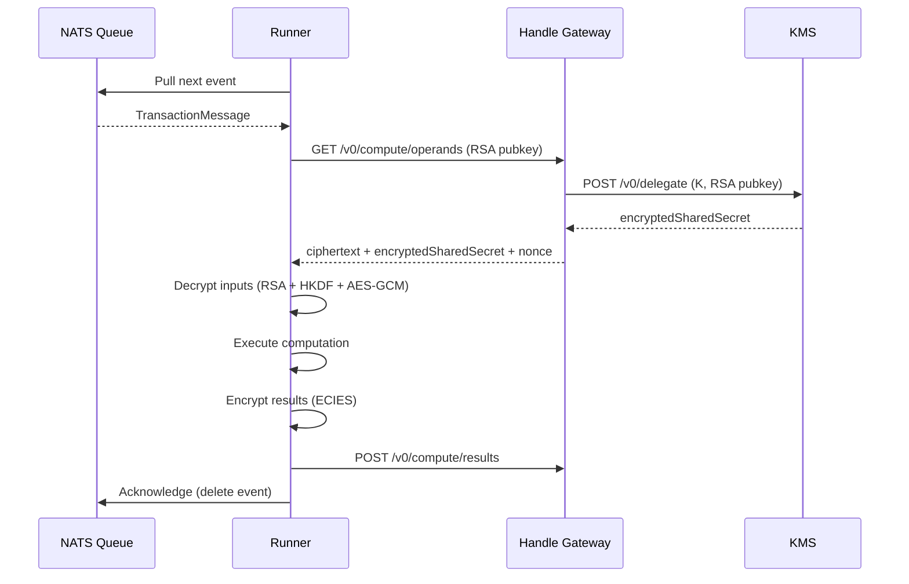
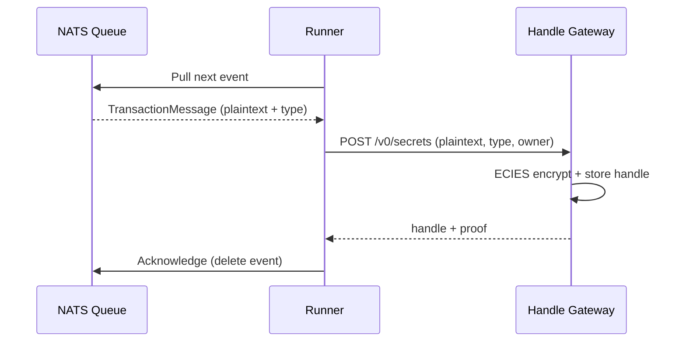

# Runner

The Runner is a Rust service running in Intel TDX that executes confidential
computations on encrypted data. It pulls computation requests from a NATS queue,
decrypts the input handles, performs the operation, re-encrypts the results, and
stores them back in the [Handle Gateway](/protocol/gateway).

## Role in the Protocol

The Runner is the computation engine of the Nox protocol. It is the only
component that manipulates plaintext values (in memory, never on disk). For
supported Solidity types, it produces results identical to their on-chain
equivalents. The off-chain execution model also opens the door to operations not
natively supported by the EVM (e.g. larger integer types).

::: info Current Implementation

The current implementation runs a **single Runner**. In the long-term
architecture, multiple Runners will operate in parallel, coordinated by a TDX
orchestrator that assigns tasks and supervises execution.

:::

## How It Works

1. **Pull event** from NATS: the Runner fetches the next `TransactionMessage`
   containing input handles, output handles, and the operation to perform
2. **Fetch operands** from the Handle Gateway: the Runner sends its RSA public
   key, and the Gateway handles KMS delegation internally, returning the
   ciphertext, encrypted shared secret, and nonce for each input handle
3. **Decrypt** inputs locally (RSA decrypt shared secret, HKDF, AES-GCM)
4. **Execute** the computation primitive
5. **Encrypt** results with ECIES using the protocol public key
6. **Submit** encrypted results to the Handle Gateway
7. **Acknowledge** the event in NATS (removes it from the queue) and pull the
   next one

### PlaintextToEncrypted (Special Case)

This operation has no input handles and does not call
`GET /v0/compute/operands`. The plaintext value and target type are embedded
directly in the NATS event. The Runner forwards the plaintext to the Handle
Gateway via `POST /v0/secrets`, which performs the ECIES encryption and stores
the result.

## Handle Requirements

Each operation defines its input/output handles:

| Operation            | Inputs | Outputs | Description                        |
| -------------------- | ------ | ------- | ---------------------------------- |
| PlaintextToEncrypted | 0      | 1       | Encrypt a plaintext value          |
| Arithmetic (add…)    | 2      | 1       | Two operands → one result          |
| Safe arithmetic      | 2      | 2       | Two operands → (success, result)   |
| Comparisons          | 2      | 1       | Two operands → bool result         |
| Select               | 3      | 1       | (condition, ifTrue, ifFalse) → one |
| Transfer             | 3      | 3       | (amount, balFrom, balTo) → 3       |
| Mint                 | 3      | 2       | (amount, balTo, supply) → 2        |
| Burn                 | 3      | 3       | (amount, balFrom, supply) → 3      |

**Validation rules:**

- All input handles **must exist** in the Gateway database
- All output handles **must not exist** in the Gateway database

## Computation Primitives

All arithmetic uses **wrapping semantics**, matching Solidity's `unchecked`
behavior. On overflow or underflow, values wrap around the type boundary instead
of reverting. Token operations (Transfer, Mint, Burn) never revert either: they
silently cap at available balances to prevent leaking information.

For the complete reference of all operations, including Solidity signatures,
edge cases and examples, see the
[Computation Primitives](/protocol/computation-primitives) page.

## Learn More

- [Computation Primitives](/protocol/computation-primitives) - Full reference of
  all operations with signatures and edge cases
- [Gateway](/protocol/gateway) - Handle storage and encryption
- [KMS](/protocol/kms) - Key management and decryption delegation
- [Nox Smart Contracts](/protocol/nox-smart-contracts) - On-chain computation
  requests
- [Global Architecture Overview](/protocol/global-architecture-overview)
